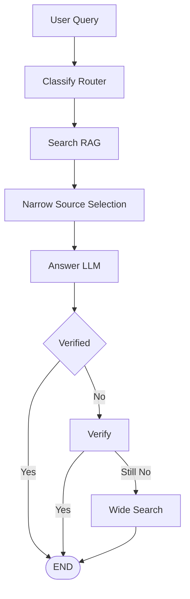
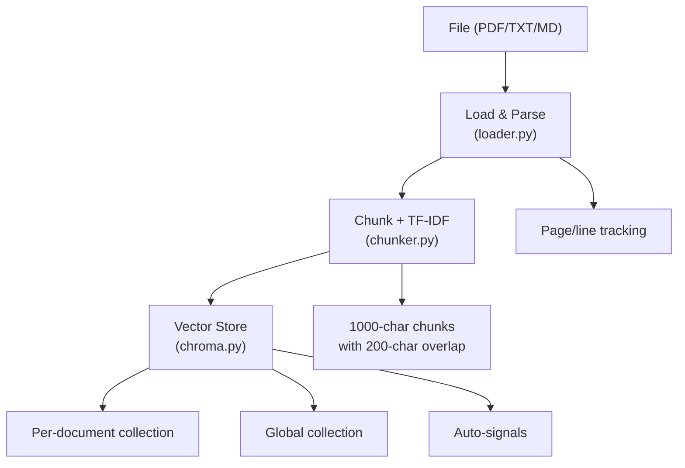
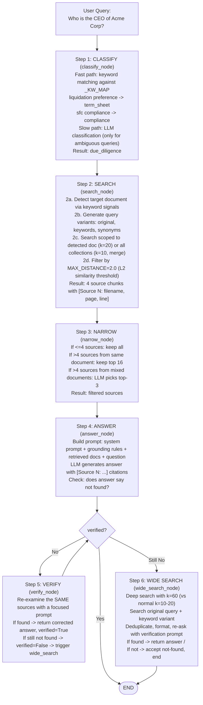

# PE AI Engineering Portfolio

> AI-powered Private Equity workflow automation with RAG and multi-agent systems.
> Built as a learning project to demonstrate end-to-end AI engineering skills.

## Table of Contents

- [Architecture Overview](#architecture-overview)
- [Technology Stack](#technology-stack)
- [Core Concepts Explained](#core-concepts-explained)
- [Project Structure](#project-structure)
- [How It Works: End-to-End Flow](#how-it-works-end-to-end-flow)
- [Features Deep Dive](#features-deep-dive)
- [Quick Start](#quick-start)
- [API Reference](#api-reference)
- [Testing](#testing)

---

## Architecture Overview

The system follows a **LangGraph StateGraph pipeline** where every query passes through the same workflow:



**Why LangGraph?** Instead of a simple if/else router, each step is a **node** in a graph with **conditional edges**. This makes the workflow inspectable, debuggable, and extensible -- you can add new nodes (like human-in-the-loop review) without changing existing code.

---

## Technology Stack

| Technology | Version | Purpose | Why Chosen |
|-----------|---------|---------|------------|
| **LangGraph** | >=0.2.0 | Agent workflow orchestration | StateGraph with conditional edges for retry loops |
| **LangChain** | >=0.3.0 | LLM framework, tools, document handling | Industry standard for RAG pipelines |
| **LangChain-DeepSeek** | >=0.1.0 | DeepSeek API integration | Cost-effective LLM with strong reasoning |
| **ChromaDB** | >=0.5.0 | Vector storage and similarity search | Lightweight, local-first, no server needed |
| **pypdf** | >=4.0.0 | PDF text extraction | Pure Python, no system dependencies |
| **FastAPI** | >=0.115.0 | REST API backend | Async, auto-docs, type-safe |
| **Next.js** | >=14.2.0 | Dynamic web application | React App Router, TypeScript, Tailwind |
| **Pydantic** | >=2.0.0 | Data validation and models | Type safety, serialization |
| **Pydantic Settings** | >=2.0.0 | Environment config management | `.env` file support, type validation |
| **Python** | >=3.11 | Runtime | Pattern matching, type unions |

### DeepSeek API

DeepSeek is used as the LLM provider. It's an open-source LLM with GPT-4-level performance at a fraction of the cost. The model `deepseek-chat` handles:
- Query classification (which agent to use)
- Document analysis (due diligence, term sheet extraction)
- Answer generation with citations
- Verification when answers seem incomplete

---

## Core Concepts Explained

### RAG (Retrieval-Augmented Generation)

Instead of relying solely on the LLM's training data, RAG **retrieves relevant documents first**, then asks the LLM to answer based on those documents.

**How it works in this project:**

1. **Ingestion**: Documents are split into chunks (~1000 characters each with 200-character overlap) and embedded into vectors using ChromaDB's default embedding model
2. **Retrieval**: When a user asks a question, the query is embedded and compared to all chunk vectors using L2 distance
3. **Generation**: The top-k most similar chunks are passed to the LLM as context, which then generates an answer grounded in those documents

**Why chunking matters:** LLMs have context windows. If you pass an entire 50-page document, the LLM may miss details. Chunking ensures the most relevant sections are retrieved and placed prominently in the context.

**Overlap:** 200-character overlap between chunks ensures sentences that span chunk boundaries aren't lost.

### LangGraph StateGraph

LangGraph models workflows as graphs where:
- **Nodes** are functions that process state
- **Edges** connect nodes (either fixed or conditional)
- **State** is a TypedDict passed through every node

**This project's graph:**

```python
class AgentState(TypedDict):
    query: str                    # Original user question
    agent_type: str               # Classified agent type
    retrieved: str                # Raw search results
    narrowed: str                 # Filtered search results
    answer: str                   # LLM-generated answer
    verified: bool                # Whether answer was verified
    citations: list[str]          # Extracted source citations
    conversation_history: list[dict]  # Chat context
```

**Conditional edges:**
- Entry: if the caller forced an agent type, classification is skipped entirely
- After `answer`: if `verified=False`, go to `verify` node; otherwise end
- After `verify`: if still `verified=False`, go to `wide_search`; otherwise end

The **verify/wide_search retry loop only fires on genuine misses** -- not on every
query. Verification triggers only when the answer explicitly states the
information was not found (e.g. `CONFIRMED NOT FOUND`), is empty, or contains
no content beyond citation tags. Boilerplate like
`RECOMMENDATION: Insufficient data to recommend.` does NOT trigger it. In the
full 180-question eval the loop fired on only 17 of 180 questions (vs. every
query before this fix) -- cutting LLM calls per question from ~4.0 to ~2.2.

**Pipeline tracing:** every node records its wall time in `state['trace']`
in execution order, surfaced in the API `metadata.trace` field and in eval
results -- so you can see exactly which path answered a question
(`classify -> search -> narrow -> answer` vs. the rescue path through
`verify -> wide_search`).

### Per-Document Collections

Instead of one giant ChromaDB collection, each uploaded document gets its **own collection**. This solves a critical problem: a 522-chunk Annual Report would otherwise drown out a 5-chunk CV in search results.

**How it works:**
- Documents are stored in both a global collection AND per-document collections
- When a query matches a specific document (via keyword detection), search is scoped to that document's collection
- When no document is detected, all collections are searched and results are merged

### Document Detection

The system uses **weighted keyword signals** to detect which document a query is about:

```python
_DOC_SIGNALS = {
    "cv-jonathandevano-hkma.pdf": (
        {"candidate": 2, "resume": 2, "bloomberg": 2, ...},  # positive signals
        {"annual report": 3, "revenue": 3, ...},              # negative signals
    ),
}
```

- **Positive signals**: keywords that indicate the query is about this document (weight 1-2)
- **Negative signals**: keywords that indicate the query is about a *different* document (weight 1-3)
- **Score**: sum of matched positive signals minus matched negative signals
- **Threshold**: score >= 2 to confidently detect a document

New uploads also get **auto-generated TF-IDF signals** stored in ChromaDB collection metadata, so document detection works for any file without manual curation. Signals are computed **per document** (never across the whole batch -- a large file would otherwise donate its vocabulary to small files' detection rules) and the detection cache is invalidated on every ingest/delete, so new uploads route correctly without a restart.

---

## Project Structure

```
rag-langgraph-langchain/
├── config/
│   └── settings.py              # Pydantic Settings: env vars -> typed config
│
├── src/
│   ├── agents/                  # Agent logic
│   │   ├── graph.py             # LangGraph StateGraph (THE core)
│   │   ├── prompts.py           # Shared prompts, grounding rules, parsers
│   │   ├── router.py            # Thin dispatcher -> invokes graph
│   │   ├── due_diligence.py     # DD agent wrapper
│   │   ├── term_sheet.py        # Term sheet agent wrapper
│   │   ├── lp_report.py         # LP report agent wrapper
│   │   └── compliance.py        # Compliance agent wrapper
│   │
│   ├── tools/
│   │   └── search.py            # LangChain tool: search + doc detection + signals
│   │
│   ├── vector_store/
│   │   └── chroma.py            # ChromaDB: per-doc collections, search, auto-signals
│   │
│   ├── ingestion/
│   │   ├── loader.py            # PDF/TXT/MD loading with page+line tracking
│   │   └── chunker.py           # Recursive text splitting + TF-IDF signal extraction
│   │
│   ├── core/
│   │   ├── models.py            # Pydantic models (DueDiligenceResult, TermSheetData, etc.)
│   │   └── constants.py         # Enums: DocumentType, RiskLevel, AgentType
│   │
│   ├── utils/
│   │   ├── llm_cache.py         # TTL-based LLM response cache (1hr, 500 entries)
│   │   └── doc_signals.py       # TF-IDF keyword extraction for auto-signals
│   │
│   └── api/
│       ├── main.py              # FastAPI app setup
│       ├── deps.py              # Dependency injection
│       └── routes/
│           ├── documents.py     # Upload, ingest, stats endpoints
│           └── agents.py        # Execute agent endpoint
│
├── data/
│   ├── sample/                  # Sample PE documents (Acme Corp)
│   │   ├── investment_memos/
│   │   ├── term_sheets/
│   │   └── financial_models/
│   ├── uploads/                 # User-uploaded documents
│   └── chroma/                  # ChromaDB persistence directory
│
├── tests/                       # 27 unit tests
├── scripts/
│   ├── ingest.py                # CLI: ingest documents into vector store
│   ├── eval_qa.py               # QA evaluation harness (180 questions)
│   ├── eval_tricky.py           # Adversarial QA check (15 tricky questions)
│   └── verify_changes.py        # E2E verification script (14 tests)
│
├── frontend/                    # Next.js application (dynamic pages)
│   └── src/
│       ├── app/                 # Next.js App Router pages
│       ├── components/          # Reusable UI components
│       └── lib/                 # API client, types, utilities
│
├── run.sh                       # App launcher (FastAPI API server)
├── pyproject.toml               # Dependencies, ruff, pytest, mypy config
├── .env.example                 # Environment template
└── .gitignore
```

---

## How It Works: End-to-End Flow

### 1. Document Ingestion



**loader.py** handles three formats:
- **PDF**: Uses pypdf to extract text per page, then splits by paragraphs (or single newlines for dense PDFs). Each paragraph gets a page number and line offset for citation tracking.
- **TXT/MD**: Splits by double-newlines into paragraphs, tracking line numbers.

**chunker.py** uses LangChain's `RecursiveCharacterTextSplitter`:
- Splits by `\n\n` -> `\n` -> `. ` -> ` ` -> `""` (recursive fallback)
- Each chunk gets metadata: filename, page, line, chunk_index, total_chunks
- At ingest time, TF-IDF keywords are extracted per document and stored as auto-signals

### 2. Query Processing



### 3. Response Parsing

Each agent type has a dedicated parser that converts LLM text output into structured Pydantic models:

```python
# Due Diligence -> DueDiligenceResult
# Parses: SUMMARY, RISKS, OPPORTUNITIES, RECOMMENDATION sections

# Term Sheet -> TermSheetData
# Parses 19 fields: COMPANY_NAME, ROUND_TYPE, PRE_MONEY_VALUATION,
#   INVESTMENT_AMOUNT, LIQUIDATION_PREFERENCE, ANTI_DILUTION,
#   BOARD_SEATS, ESOP_POOL, PROTECTIVE_PROVISIONS, etc.

# LP Report -> LPReport
# Parses: QUARTER, HIGHLIGHTS, FINANCIAL_SUMMARY, RISK_FACTORS

# Compliance -> ComplianceCheck
# Parses: DOCUMENT_NAME, COMPLIANT, ISSUES, JURISDICTION,
#   REGULATIONS_CHECKED
```

**Citation handling:** The parser strips `[Source N: ...]` tags from field values to prevent parse errors (e.g., `float("$50M [Source 1: ...]")` would crash). If stripping leaves an empty value, it falls back to a default.

---

## Features Deep Dive

### 1. Smart Search with Multiple Strategies

The search tool doesn't just do a single vector similarity search. It combines **five strategies**:

| Strategy | What it does | When it helps |
|----------|-------------|---------------|
| **Primary search** | Standard vector similarity on the query | Always runs |
| **Keyword extraction** | Strips stop words, searches bare terms | "What is the ARR?" -> searches "ARR" |
| **Synonym expansion** | Adds related terms | "email" -> searches "email contact address" |
| **Year stripping** | Removes years from query | "2025 Conference" -> searches "Conference" |
| **Document scoping** | Searches only the detected document's collection | Prevents 522-chunk Annual Report from drowning 5-chunk CV |

**Relevance threshold:** `MAX_DISTANCE = 2.0` -- results above this L2 distance are discarded. This prevents unrelated documents (weather, sports) from appearing in results.

### 2. Citation System

Every answer includes citations with **document name, page number, and line number**:

```
[Source 1: sample_investment_memo.md, page 1, line 5]
Sarah Chen is the CEO and Founder of Acme Corp.
```

**How line numbers work:**
- **PDFs**: Each page is split into paragraphs. Each paragraph gets a line offset within the page (e.g., page 3, line 2 = second paragraph on page 3).
- **TXT/MD**: Split by double-newlines. Line number = paragraph position in the file.
- **Dense PDFs** (no double-newlines): Falls back to single-newline splitting.

### 3. Conversation Memory

The Next.js UI passes the last 6 messages as `conversation_history` to the graph. The history is injected into both the classification step (to disambiguate follow-ups like "and its CEO?") and the answer prompt, so multi-turn references actually work.

### 4. LLM Response Caching

A TTL-based in-memory cache (`llm_cache`) avoids redundant API calls:
- **Classification results** cached per query (1hr TTL)
- **Search results** cached per query + agent type (1hr TTL)
- **Max 500 entries** with LRU eviction

### 5. Auto-Generated Document Signals

When a new document is ingested, TF-IDF keyword extraction runs automatically:
- Extracts top-15 keywords per document
- Stores them as `auto_positive_signals` in ChromaDB collection metadata
- At query time, these signals merge with hardcoded signals for document detection

This means **any uploaded PDF immediately gets smart routing** without manual keyword curation.

### 6. File Upload

Documents can be uploaded via:
- **Next.js Documents page**: Drag-and-drop PDF, TXT, or MD files. Auto-ingested into vector store.
- **API endpoint**: `POST /api/documents/upload` with multipart form data.

### 7. Grounding Rules

All agents follow strict grounding rules to prevent hallucination:
- Answer ONLY from retrieved documents
- Give EXACT values as written (no paraphrasing)
- Cite every fact with `[Source N: filename, page X, line Y]`
- If information is missing, synthesize from available content (don't just refuse)
- Never fabricate data

### 8. Verification Loop

When the LLM says "not found", the system doesn't give up:
1. **Re-examine** the same sources with a focused, neutral prompt
2. **Wide search** across all collections with fair per-document sampling -- chunks are interleaved round-robin across documents (never score-ordered from one dominant file), and document detection is NOT re-applied, since reaching this node means the earlier scoping decision was suspect
3. **Re-answer** with the expanded context

This catches misrouting (e.g. a query about the CV mentioning "Archbridge" being scoped to the Acme memo) and cases where the answer exists but the LLM initially missed it. The rescue answer may be free-form (no section headers); the parser falls back to using the full text so it isn't dropped.

### 9. Source Selection for Mixed-Document Results

When search returns chunks from multiple documents, an LLM call picks the **top-3 most relevant sources** to avoid overwhelming the answer LLM with irrelevant context.

Single-document results keep all sources (up to 16) since small documents need every chunk for accurate answers.

---

## Quick Start

### Prerequisites
- Python 3.11+
- Node.js 18+
- DeepSeek API key (get one at https://platform.deepseek.com)

### Installation

```bash
# Clone and enter the project
git clone <repo-url>
cd rag-langgraph-langchain

# Create virtual environment
python -m venv venv
source venv/bin/activate  # Windows: venv\Scripts\activate

# Install Python dependencies
pip install -e ".[dev]"

# Install frontend dependencies
cd frontend && npm install && cd ..

# Set up environment
cp .env.example .env
# Edit .env and set DEEPSEEK_API_KEY
```

### Ingest Sample Documents

```bash
python scripts/ingest.py
```

### Run the App

**Option A: Full launcher (recommended)**
```bash
# Terminal 1: Start FastAPI backend
./run.sh

# Terminal 2: Start Next.js frontend
cd frontend && npm run dev
```

**Option B: Individual services**
```bash
# Backend only
uvicorn src.api.main:app --reload

# Frontend only
cd frontend && npm run dev
```

**Option C: With flags**
```bash
./run.sh --skip-install     # Skip pip install
./run.sh --skip-ingest      # Skip document ingestion
./run.sh --api-port=9000    # Custom API port
```

### Upload Your Own Documents

Via Next.js: Use the Documents page file uploader (PDF, TXT, MD supported).

Via API:
```bash
curl -X POST http://localhost:8000/api/documents/upload \
  -F "file=@your_document.pdf"
```

---

## API Reference

| Method | Endpoint | Description |
|--------|----------|-------------|
| `GET` | `/health` | Health check |
| `GET` | `/api/agents` | List available agents |
| `POST` | `/api/agents/execute` | Execute an agent with a query |
| `POST` | `/api/documents/upload` | Upload a document (auto-ingested) |
| `POST` | `/api/documents/ingest` | Re-ingest all sample documents |
| `GET` | `/api/documents/stats` | Get document/chunk counts |

### Example: Execute Agent

```bash
curl -X POST http://localhost:8000/api/agents/execute \
  -H "Content-Type: application/json" \
  -d '{"query": "What is the ARR of Acme Corp?", "agent_type": "due_diligence"}'
```

---

## Testing

### Unit Tests (27 tests)

```bash
pytest tests/ -v
```

Tests cover: models, ingestion, chunking, vector store, search tools, agents, API endpoints.

### Verification Script (14 tests)

```bash
python scripts/verify_changes.py
```

Headless tests that exercise the real pipeline:
- Graph builds and compiles
- Keyword classification
- All 4 parsers with various LLM output formats
- Citation stripping
- Not-found detection
- LLM cache (set, get, LRU eviction, clear)
- Auto-signal extraction
- Vector store search
- Document detection
- Agent wrapper instantiation
- E2E mock pipeline
- Graph conditional edges
- Numeric parsing (`_safe_float`)
- Semicolon list parsing

### QA Evaluation Harness

```bash
python scripts/eval_qa.py                    # Run all 180 questions
python scripts/eval_qa.py --filter cv        # Run CV questions only
python scripts/eval_qa.py --retry-failed     # Re-run previously failed questions
python scripts/eval_tricky.py                # 15 adversarial questions
```

Evaluates 180 questions across 6 uploaded PDFs with normalized scoring (handles currency formats, units, plurals). Each run records per-question latency, the node path taken (`trace`), and run-level metadata (LLM call counts, node usage) into `eval_results.json`. Current baseline: **170-180/180 (~94%)** at ~2.2 LLM calls per question.

`scripts/eval_tricky.py` is an adversarial check with 15 deliberately hard questions: cross-document ambiguity (two CEOs in the corpus), misrouting bait, negative numbers, unit/acronym phrasing, term-sheet extraction routing, and genuine not-found cases.

Known limitations: word-per-line PDF tables (e.g. the syllabus grading/assessment table) can confuse both retrieval and the model on date/grade-pairing questions, and very large financial documents can tempt the model into quoting detail-table figures over the executive-summary figures.

---

## Configuration

All settings are managed via environment variables (`.env` file):

| Variable | Default | Description |
|----------|---------|-------------|
| `DEEPSEEK_API_KEY` | (required) | DeepSeek API key |
| `DEEPSEEK_MODEL` | `deepseek-chat` | LLM model name |
| `DEEPSEEK_TEMPERATURE` | `0.0` | LLM temperature (0 = deterministic) |
| `CHROMA_PERSIST_DIRECTORY` | `./data/chroma` | ChromaDB storage path |
| `CHROMA_COLLECTION_NAME` | `pe_documents` | Global collection name |
| `CHUNK_SIZE` | `1000` | Max characters per chunk |
| `CHUNK_OVERLAP` | `200` | Overlap between chunks |
| `RETRIEVAL_K` | `4` | Default number of search results |
| `LOG_LEVEL` | `INFO` | Logging level |

---

## Key Design Decisions

### Why per-document collections instead of one big collection?

A 522-chunk Annual Report would dominate search results for any query, even about a 5-chunk CV. Per-document collections ensure each document gets fair representation.

### Why keyword detection + vector search?

Vector search alone can't scope to the right document when multiple documents are loaded. Keyword detection with weighted signals provides fast, deterministic routing. The vector search then does the heavy lifting within the scoped collection.

### Why a verification loop?

LLMs sometimes say "not found" when the answer IS in the context -- especially with large retrieval sets. The verification node re-examines with a focused, neutral prompt, catching false negatives and misroutes. The loop is gated to fire only on real misses (explicit not-found statements, empty or citation-only answers), so it costs ~2.2 LLM calls per question instead of 4.

### Why LLM caching?

Each query triggers 1-5 LLM API calls (classification + answer + optional verification). Caching avoids paying for repeated calls on identical queries, especially important during development and testing.

---

## License

MIT License
