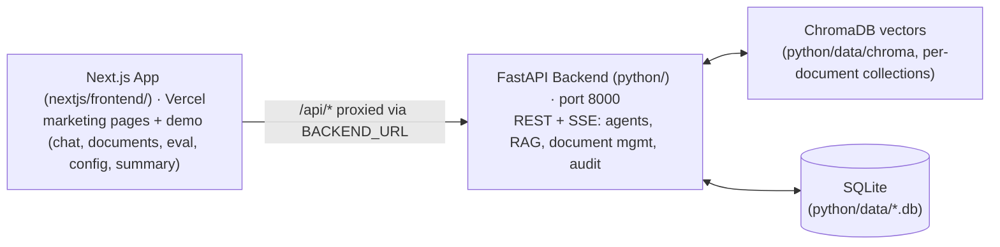

# PE AI Engineering Platform

> AI-powered Private Equity workflow automation with RAG and multi-agent systems.
> Two-tier stack: a Next.js app (marketing pages + live demo) and a FastAPI backend.

---

## Table of Contents

- [Architecture Overview](#architecture-overview)
- [Technology Stack](#technology-stack)
- [Frontend (Next.js)](#frontend-nextjs)
- [Backend (FastAPI)](#backend-fastapi)
- [Advanced Backend Capabilities](#advanced-backend-capabilities)
- [Database Schema](#database-schema)
- [OneDrive Integration](#onedrive-integration)
- [Design System (JS\&C)](#design-system-jsc)
- [Core Concepts](#core-concepts)
- [Project Structure](#project-structure)
- [Quick Start](#quick-start)
- [Testing](#testing)
- [Configuration](#configuration)
- [Repository split (2026-09-04)](#repository-split-2026-09-04)
- [Progress Log](#progress-log)

---

## Architecture Overview



**Why two tiers?**
- **Next.js** serves the marketing pages as static routes (services, blog, work, products, applications, contact, support) plus the dynamic demo pages (chat, documents, eval, config, summary), all in one App Router app
- **FastAPI** is a pure API server -- no HTML rendering, no static files, just JSON endpoints

The Next.js app proxies `/api/*` requests to the FastAPI backend via `next.config.js` rewrites whose destination honors the `BACKEND_URL` environment variable (default `http://127.0.0.1:8000` locally), so the frontend never needs to know the backend URL.

**Production layout:** this repository is the combined dev workspace and archive. The two tiers ship as separate repositories that talk by URL: [`jonathan-simpson-it/jsnc-demo-automation-nextjs`](https://github.com/jonathan-simpson-it/jsnc-demo-automation-nextjs) (Next.js on Vercel) and [`jonathan-simpson-it/jsnc-demo-automation-python`](https://github.com/jonathan-simpson-it/jsnc-demo-automation-python) (backend on an always-on host). See `docs/deploy.md`.

---

## Technology Stack

| Technology | Version | Purpose |
|-----------|---------|---------|
| **Next.js** | >=14.2 | Marketing site + dynamic web application (App Router, TypeScript, Tailwind) |
| **React** | >=18.3 | UI framework |
| **Tailwind CSS** | >=3.4 | Utility-first CSS with JS\&C custom theme |
| **FastAPI** | >=0.115 | REST API backend (async, auto-docs) |
| **LangGraph** | >=0.2 | Agent workflow orchestration (StateGraph) |
| **LangChain** | >=0.3 | LLM framework, tools, document handling |
| **LangChain-DeepSeek** | >=0.1 | DeepSeek API integration |
| **ChromaDB** | >=0.5 | Vector storage and similarity search |
| **SQLite** | built-in | Platform data plus audit, RBAC, model-version, and cache stores |
| **pypdf** | >=4.0 | PDF text extraction |
| **Pydantic** | >=2.0 | Data validation and models |
| **Python** | >=3.11 | Runtime |

---

## Frontend (Next.js)

### Pages

| Route | Page | Description |
|-------|------|-------------|
| `/` | **Launchpad** | Registry-driven category grid of every app (chat, documents, workbenches, radar, developer tools) with SVG icons and "Open" actions; see [Adding an App](#adding-an-app-launchpad) |
| `/chat` | **AI Chat** | Streaming SSE chat with a project workspace rail + saved history, agent pre-selection, suggested-question chips, live pipeline node status, citation display, pipeline inspector, friendly error states, and per-message workspace labels showing which project grounded each answer |
| `/documents` | **Documents** | Client → Project workspace tree sidebar with strict per-project RAG isolation; drop-anywhere upload queue with live per-file progress, OneDrive tab, assign modal, inline tagging |
| `/workbench/term-sheet` | **Term Sheet Workbench** | Pick in-scope documents and extract structured term-sheet data into a result dashboard |
| `/workbench/lp-report` | **LP Report Workbench** | Draft quarterly LP reports from selected documents |
| `/workbench/compliance-audit` | **Compliance Auditor** | Audit documents against SFC, HKMA and AMLO expectations with cited findings and corrective actions |
| `/workbench/filing-cabinet` | **Filing Cabinet** | Ingest and route target-company files into the right project workspaces |
| `/review-hub` | **Review Hub** | Approve, edit, or reject AI answers before anything is delivered — humans in the loop |
| `/telemetry` | **Pipeline & Cost** | Live pipeline traces, token usage, and DeepSeek cost analytics |
| `/radar` | **Regulatory Radar** | Live SFC and HKMA circulars with recency-weighted retrieval — grounded in today's guidance |
| `/eval` | **Eval Dashboard** | Accuracy metrics, per-document breakdown, question results with pass/fail, filters |
| `/config` | **Configuration** | System status, API version, features list, agent types |
| `/summary` | **Email Reports** | Week/month reports from the audit trail, agent usage, recent queries, email preview |

### Components

| Component | Purpose |
|-----------|---------|
| `Header` | Skip-to-content link, serif brand mark, pill-shaped nav with active state |
| `Footer` | 5-column JS\&C grid: brand wordmark, Connect, Read, Help, Start columns |
| `StatusBadge` | System health indicator (green/yellow/red dot + label) |
| `ChatMessage` | User/assistant message bubbles with agent label, workspace scope label (e.g. `JS&C › Personal`), citations, trace summary; renders suggestion chips under the welcome message with click-to-send |
| `PipelineInspector` | Expandable panel showing confidence bar, agent path, per-node timing bars |
| `Launchpad` | `LaunchpadTile` + `LaunchpadSection`: launchpad-style app tiles and category grids |
| `Workbench` | Shared workbench scaffold: `WorkbenchPage` layout, `DocumentPicker` for in-scope document selection, `ResultPanel` structured output renderer |
| `StructuredOutput` | Renders structured agent JSON (term sheets, LP reports, compliance findings) as a readable result card |
| `CitationList` | Dedicated citation list renderer for sourced answers |
| `StatCard` | Small metric/value card used on dashboards |

### Lib Modules

| Module | Exports |
|--------|---------|
| `api.ts` | `fetchHealth`, `fetchAgents`, `streamAgent` (async generator), `uploadDocument`, `fetchDocumentList`, `assignDocument`, `addDocumentTag`, `removeDocumentTag`, `fetchClients`, `createClient`, `fetchProjects`, `createProject`, `fetchTags`, `createTag`, `fetchOneDriveStatus`, `fetchOneDriveFiles`, `importFromOneDrive`, `connectOneDrive`, `disconnectOneDrive` |
| `types.ts` | TypeScript interfaces matching all Pydantic models + `Client`, `Project`, `Tag`, `OneDriveFile`, `OneDriveStatus` |
| `utils.ts` | `parseCitation`, `traceSummary`, `formatMs`, `cn` |
| `apps.tsx` | Launchpad registry: `LaunchpadApp` type, `LAUNCHPAD_APPS`, `appsByCategory()` |
| `Launchpad.tsx` | `LaunchpadTile`, `LaunchpadSection` components rendering the launchpad grid |

### Adding an App (Launchpad)

The homepage is a launchpad grid driven by the registry in `frontend/src/lib/apps.tsx`. Adding an app takes three steps:

1. **Create the page route** under `frontend/src/app/...`
2. **Register it**: add a `LaunchpadApp` entry to `LAUNCHPAD_APPS` with a `category` from `AppCategory` (`Applications`, `Specialist Agents`, `Workbenches`, `Compliance & Risk`, `Operations`, `Developer`) and an inline SVG icon (`stroke="currentColor"` so it inherits the accent color)
3. **Optional**: add a header-nav entry in `frontend/src/components/Header.tsx` if the app deserves top-level reachability

The homepage renders every category automatically via `appsByCategory()`.

### Streaming Chat

The chat page uses Server-Sent Events (SSE) for real-time streaming:

```
User types query
  -> POST /api/agents/execute/stream
  -> Backend streams events: { node: "classify" }, { node: "search" }, ...
  -> Frontend displays the current pipeline node in the chat header (live)
  -> Final event: { done: true, response: { agent_type, result, citations, metadata } }
```

The `streamAgent()` function is an async generator that yields `StreamEvent` objects as they arrive. Each query also sends the last 6 conversation messages so agents can follow up on earlier context.

**Chat UX (Phase 7):**
- **Suggestion chips** - The welcome message shows 3 agent-specific suggested questions; chips update when the agent selector changes and send their query on click
- **Live pipeline status** - The chat header shows the current graph node ("Classifying query", "Searching documents", ...) with an animated 3-dot indicator while streaming
- **Streaming feedback** - The send button swaps to animated dots while a request is in flight; a "thinking" bubble appears while waiting for the first node event
- **Friendly error handling** - Backend 500s, auth failures (401/403), and network failures are mapped to actionable messages (e.g. "Make sure `DEEPSEEK_API_KEY` is configured") instead of raw errors; a stream that yields no final response shows a rephrase-and-retry hint
- **Agent-aware input** - Placeholder text names the selected agent; an empty state guides first-time users to try a suggestion chip

---

## Backend (FastAPI)

### Endpoints

| Method | Endpoint | Description |
|--------|----------|-------------|
| `GET` | `/health` | Health check |
| `GET` | `/api/agents` | List 5 agents with names and descriptions |
| `POST` | `/api/agents/execute` | Execute agent (non-streaming) |
| `POST` | `/api/agents/execute/stream` | Execute agent with SSE streaming |
| `GET` | `/api/documents/stats` | Document/chunk counts with summaries |
| `GET` | `/api/documents/list` | List documents filtered by client, project, or tag |
| `POST` | `/api/documents/upload` | Upload and auto-ingest document |
| `POST` | `/api/documents/ingest` | Re-ingest all sample documents |
| `PUT` | `/api/documents/{id}/assign` | Assign client and/or project to document |
| `GET` | `/api/documents/tags` | List all tags |
| `POST` | `/api/documents/tags` | Create a new tag |
| `DELETE` | `/api/documents/tags/{id}` | Delete a tag |
| `POST` | `/api/documents/{id}/tags` | Add tag to document |
| `DELETE` | `/api/documents/{id}/tags/{tag_id}` | Remove tag from document |
| `GET` | `/api/clients` | List all clients |
| `POST` | `/api/clients` | Create a client |
| `PUT` | `/api/clients/{id}` | Update a client |
| `DELETE` | `/api/clients/{id}` | Delete a client |
| `GET` | `/api/projects` | List projects (filterable by client_id) |
| `POST` | `/api/projects` | Create a project |
| `PUT` | `/api/projects/{id}` | Update a project |
| `DELETE` | `/api/projects/{id}` | Delete a project |
| `GET` | `/api/onedrive/status` | Check OneDrive connection status |
| `GET` | `/api/onedrive/connect` | Start Microsoft OAuth flow |
| `GET` | `/api/onedrive/callback` | Handle OAuth redirect |
| `GET` | `/api/onedrive/files` | Browse OneDrive files and folders |
| `POST` | `/api/onedrive/import` | Import a file from OneDrive to knowledge base |
| `POST` | `/api/onedrive/disconnect` | Disconnect OneDrive |
| `GET` | `/api/conversations` | List chat history (grouped by project on the client) |
| `POST` | `/api/conversations` | Create a chat conversation (optional `project_id`) |
| `DELETE` | `/api/conversations/{id}` | Delete a conversation and its messages |
| `GET` | `/api/conversations/{id}/messages` | Return a conversation's messages |
| `GET` | `/api/review/queue` | Pending human-review items |
| `POST` | `/api/review/{id}/approve` | Approve (or approve with an edited answer) |
| `POST` | `/api/review/{id}/reject` | Reject without delivering |
| `GET` | `/api/telemetry/runs` | Recent pipeline runs (traces, latency, cost) |
| `GET` | `/api/telemetry/cost` | Token/cost summary by graph node |
| `POST` | `/api/telemetry/reset` | Reset cost totals and run log |
| `GET` | `/api/regulatory/status` | Radar poll state |
| `GET` | `/api/regulatory/feed` | Ingested SFC/HKMA items |
| `POST` | `/api/regulatory/poll` | Run one fetch + ingest cycle |
| `POST` | `/api/summary` | Generate email summary for a given period |
| `GET` | `/api/eval/results` | Return eval results JSON |

### Agent Types

| Agent | Name | Description |
|-------|------|-------------|
| `due_diligence` | Due Diligence Agent | Analyse investment opportunities and surface the risks a senior analyst would catch. |
| `term_sheet` | Term Sheet Extractor | Extract structured term-sheet data in seconds, not spreadsheets. |
| `lp_report` | LP Report Generator | Quarterly LP reports drafted from the documents you already hold. |
| `compliance` | Compliance Checker | Regulatory compliance checks grounded in the knowledge base — SFC, HKMA and AMLO-aware. |
| `cross_doc` | Cross-Document Comparison | Compare and synthesise across documents — find the differences that change a deal. |

---

## Advanced Backend Capabilities

Beyond the core endpoints, the backend ships deeper capabilities that drive retrieval quality, pipeline observability, and compliance/governance. Each is marked **active** (on by default), **flag-gated** (off unless enabled via env var, see Configuration), or **library** (implemented and unit-tested, not yet wired into the graph or API).

### Retrieval Engine

| Capability | Status | What it does |
|-----------|--------|--------------|
| Per-document Chroma collections | Active | Dual-write: every chunk lands in a global collection plus a per-document collection; search merges results with fair per-document sampling so one large deck cannot crowd out smaller memos |
| Auto TF-IDF signals | Active | Keyword + bigram signals extracted per document at ingest, stored in collection metadata, and merged with hardcoded weighted signals for document detection |
| Hybrid vector + BM25 search | Active | Pure-Python BM25 (k1=1.5, b=0.75) blended with vector similarity (`0.6 * vector + 0.4 * BM25`) after distance-threshold filtering |
| Query variants | Active | Synonym expansion and year-stripping variants generated when initial retrieval is weak |
| LLM query rewrite | Flag-gated | Optional LLM-based query reformulation (`ENABLE_LLM_REWRITE`) |
| Keyword re-ranker | Library | Dependency-free keyword-precision re-ranking (TF tiebreak); unit-tested but not yet plugged into the hybrid search pipeline |

### Graph Pipeline Details

```
entry -> classify -> search -> narrow -> answer -> [review] -> verify -> [wide_search] -> end
```

- **classify** - Keyword fast-path first, LLM fallback when ambiguous, conversation-aware; skipped entirely when an agent type is forced (`?agent=` or `agent_type` in the API request)
- **search** - Document detection via weighted signals, then hybrid retrieval (above)
- **narrow** - LLM source selection, plus a single-document dominance rule when one source clearly covers the question
- **answer** - LLM generation with retries when the response comes back empty or citation-only
- **review** (optional human-in-the-loop) - With `ENABLE_HUMAN_REVIEW=on` the answer pauses here and supports approve / edit (replaces the answer) / pending; the router exposes a `human_review` state the UI can collect
- **verify** - Groundedness check; an empty, citation-only, or not-found answer escalates to `wide_search` instead of ending
- **wide_search** - "Rescue mode": samples documents round-robin for fair representation, then regenerates a grounded answer
- Every node is traced (`node` + `ms`); traces drive SSE node events, the frontend pipeline inspector, and confidence scoring

### Confidence Scoring

Per-query confidence is computed from real trace signals (`src/utils/confidence.py`) rather than guessed: rescue-path penalties, citation count and source diversity, pipeline depth, and document-scoping bonuses combine into a 0-1 score, with routing-method classification ("routed", "forced", "rescue").

### Compliance & Governance

| Module | Store | What it does |
|--------|-------|--------------|
| Audit log | `data/audit.db` | Tamper-evident, SHA-256 hash-chained record of every query/response with user attribution; integrity verification and regulator export |
| RBAC | `data/rbac.db` | Roles (admin to viewer) with permissions, per-user per-document grants, and `read_all` checks |
| PII redaction | helpers | Detects and redacts HK-specific PII (HKID, phone numbers, addresses, bank accounts, credit cards, email) with overlap-aware priority ordering |
| Explainability reports | helpers | Renders the pipeline trace into a regulator-ready Markdown artifact (per-node timing, rescue-path explanation, sources, confidence justification) for HKMA/SFC-style audits |
| Model version tracking | `data/model_versions.db` | Records each model deployment with a config hash for freeze/rollback evidence |
| Email summary generator | reads audit log | Turns the audit trail into weekly/monthly email-ready Markdown reports (metrics, agent usage %, top queries) |

RBAC, PII redaction, and model-version tracking are exercised by their own unit tests but are not yet wired into the chat execute path or exposed as endpoints.

### Observability & Ops

| Module | What it does |
|--------|--------------|
| Cost tracker | Per-node token and cost accounting at DeepSeek rates ($0.14 / 1M input, $0.28 / 1M output tokens) with thread-safe summary and reset |
| Structured logger | JSON or text logs; a pipeline filter injects query, agent type, node, and latency context into every record |
| Persistent LLM cache | SQLite-backed cache at `data/llm_cache.db` with TTL expiry (1h) and LRU eviction (500 entries) that survives restarts |
| Confidence scoring | See above; feeds the frontend `PipelineInspector` confidence bar |

### Document Processing

| Capability | What it does |
|-----------|--------------|
| Table extraction | Detects pipe-delimited tables in extracted PDF text, parses headers/rows, and re-formats them for reliable retrieval |
| Ingest-time summaries | One-paragraph LLM summary per document, stored in collection metadata and surfaced in the documents list |
| Document versioning | Snapshots document versions to disk with an index and unified-diff comparisons between versions |
| Loader formats | PDF, TXT, and Markdown extraction, chunked at 1000 chars with 200 overlap |

### Standalone Domain Libraries

Implemented and unit-tested, but not yet wired into the graph or API -- so they intentionally do **not** appear as agent cards:

| Module | What it does |
|--------|--------------|
| `CashFlowForecaster` | Revenue/expense projection from financial-model documents |
| `CovenantMonitor` | Covenant ratio breach/warning detection with severity classification |
| Entity linking | Entity detection plus cross-document entity linking |
| Currency & jurisdiction registry | `Currency` / `Jurisdiction` enums with symbols and a jurisdiction-to-regulation table (HKMA/SFC/AMLO, MAS, CSRC, SEC, FCA) |

---

## Database Schema

The platform database lives at `data/platform.db` with the following tables:

```sql
-- Clients (e.g., "Acme Corp", "Enosis")
CREATE TABLE clients (
    id INTEGER PRIMARY KEY AUTOINCREMENT,
    name TEXT NOT NULL UNIQUE,
    created_at TEXT DEFAULT (datetime('now'))
);

-- Projects (e.g., "Series A Round", "Q3 Audit")
CREATE TABLE projects (
    id INTEGER PRIMARY KEY AUTOINCREMENT,
    name TEXT NOT NULL,
    client_id INTEGER,  -- FK -> clients.id
    created_at TEXT DEFAULT (datetime('now'))
);

-- Documents (tracks uploads and OneDrive imports)
CREATE TABLE documents (
    id INTEGER PRIMARY KEY AUTOINCREMENT,
    filename TEXT NOT NULL,
    collection TEXT DEFAULT 'pe_documents',
    chunks INTEGER DEFAULT 0,
    summary TEXT DEFAULT '',
    doc_type TEXT DEFAULT '',
    client_id INTEGER,   -- FK -> clients.id
    project_id INTEGER,  -- FK -> projects.id
    source TEXT DEFAULT 'upload',  -- 'upload' or 'onedrive'
    onedrive_id TEXT,
    onedrive_path TEXT,
    created_at TEXT DEFAULT (datetime('now'))
);

-- Tags (e.g., "confidential", "draft", "approved")
CREATE TABLE tags (
    id INTEGER PRIMARY KEY AUTOINCREMENT,
    name TEXT NOT NULL UNIQUE,
    color TEXT DEFAULT '#80988f'
);

-- Document-Tag junction (many-to-many)
CREATE TABLE document_tags (
    document_id INTEGER NOT NULL,
    tag_id INTEGER NOT NULL,
    PRIMARY KEY (document_id, tag_id)
);

-- Chat history, grouped by project (project_id NULL = Global workspace)
CREATE TABLE conversations (
    id INTEGER PRIMARY KEY AUTOINCREMENT,
    project_id INTEGER,
    title TEXT NOT NULL DEFAULT 'New chat',
    created_at TEXT DEFAULT (datetime('now')),
    updated_at TEXT DEFAULT (datetime('now'))
);

-- Messages per conversation (citations/trace stored as JSON)
CREATE TABLE conversation_messages (
    id INTEGER PRIMARY KEY AUTOINCREMENT,
    conversation_id INTEGER NOT NULL,
    role TEXT NOT NULL CHECK (role IN ('user', 'assistant')),
    content TEXT NOT NULL,
    agent_type TEXT,
    citations TEXT DEFAULT '[]',
    trace TEXT DEFAULT '[]',
    confidence REAL,
    is_error INTEGER DEFAULT 0,
    created_at TEXT DEFAULT (datetime('now'))
);

-- OneDrive OAuth tokens (single-row, id=1)
CREATE TABLE onedrive_tokens (
    id INTEGER PRIMARY KEY CHECK (id = 1),
    access_token TEXT,
    refresh_token TEXT,
    expires_at TEXT,
    user_email TEXT,
    connected_at TEXT DEFAULT (datetime('now'))
);
```

**Relationships:**
- A client has many projects
- A project belongs to one client
- A document can belong to one client and one project
- A document can have many tags (and vice versa)
- A project has many conversations; a conversation has many messages
- A conversation can live in the **Global workspace** (`project_id` NULL) or be scoped to one project

**Storage layout** (all under `data/`): the platform schema above lives in `platform.db`; separate SQLite files back the compliance and caching subsystems described in [Advanced Backend Capabilities](#advanced-backend-capabilities) -- `audit.db` (hash-chained audit trail), `rbac.db` (roles and document grants), `model_versions.db` (model deployment records), and `llm_cache.db` (persistent LLM response cache).

---

## OneDrive Integration

### Setup

1. Go to [Azure Portal](https://portal.azure.com) > App registrations > New registration
2. Set redirect URI to `http://localhost:8000/api/onedrive/callback`
3. Add API permission: `Files.Read.All` (Delegated)
4. Create a client secret
5. Set environment variables:

```bash
ONEDRIVE_CLIENT_ID=your-client-id
ONEDRIVE_CLIENT_SECRET=your-client-secret
```

### Flow

1. User clicks "Connect OneDrive" on the Documents page
2. Redirects to Microsoft login (OAuth 2.0 authorization code flow)
3. After login, callback receives auth code, exchanges for tokens
4. Tokens stored in `onedrive_tokens` table (single row, auto-refresh)
5. User can browse OneDrive folders and import files directly to the knowledge base
6. Imported files are saved to `data/uploads/`, ingested into ChromaDB, and tracked in the `documents` table with `source='onedrive'`

---

## Design System (JS\&C)

All UI follows the JS\&C design system from `DESIGN-jonathansimpson.md`:

### Color Tokens

```css
--color-bg: #f4f4ef        /* warm cream page background */
--color-surface: #ffffff    /* cards, panels, elevated surfaces */
--color-ink: #161714        /* primary text (near-black) */
--color-muted: #5c5e56      /* secondary text (olive-gray) */
--color-line: #d6d8d1       /* borders, dividers */
--color-accent: #80988f     /* sage green (the only color) */
--color-accent-soft: #e3e9e6 /* soft sage for chip backgrounds */
```

### Typography

- **Headings** (h1, h2): Georgia serif, fluid `clamp()` sizing
- **Body**: Inter sans-serif, `0.88rem--1rem`
- **Labels**: Uppercase, `0.72rem`, `letter-spacing: 0.08em`, accent color
- **Buttons**: Uppercase, `0.78rem`, `letter-spacing: 0.06em`, pill-shaped
- **Code**: IBM Plex Mono, `0.82rem`

### Patterns

- **Section intro**: `.section-eyebrow` + h2 + description paragraph
- **Panel card**: 1px border, `border-radius: 1rem`, subtle shadow, hover lift
- **Chip/tag**: Pill-shaped, accent-soft background, line border
- **Container**: `min(72rem, calc(100% - 2.5rem))` centered
- **Section spacing**: `clamp(4rem, 9vw, 7.5rem)` vertical padding

---

## Core Concepts

### RAG (Retrieval-Augmented Generation)

Documents are chunked (~1000 chars, 200 overlap), embedded into ChromaDB vectors, and retrieved at query time. The LLM answers grounded in retrieved chunks with `[Source N: filename, page, line]` citations.

### LangGraph StateGraph

Every query runs through a compiled `StateGraph` of traced nodes with conditional edges:


The verification loop catches false negatives: an answer that is empty, citation-only, or not found in the retrieved sources escalates to a `wide_search` rescue pass instead of ending. With `ENABLE_HUMAN_REVIEW=on`, answers pause at a review node where a human can approve, edit, or defer them. Node execution is traced (node name + duration) and streamed to the frontend as SSE events; see [Advanced Backend Capabilities](#advanced-backend-capabilities) for details on retrieval blending, confidence scoring, and the compliance suite.

### Per-Document Collections

Each uploaded document gets its own ChromaDB collection, preventing large documents from dominating search results for small ones.

### Auto-Generated Signals

TF-IDF keywords are extracted per document at ingest time and stored as auto-signals for document detection routing.

### Project-Scoped Chat & Retrieval

Chats are grouped by **project workspace**. Each conversation stores every turn in SQLite (`conversations` + `conversation_messages`); the chat page's left rail lists history per workspace and each new turn is persisted server-side, with the last 10 messages injected into the graph as conversation context.

Retrieval is isolated by project: when a conversation belongs to a project, the backend resolves that project's document filenames (`documents.project_id`) and restricts the search universe -- document detection, per-document collections, and the wide-search rescue pass -- to those files. The global `pe_documents` fallback is disabled under a scope, so answers can never cite another project's documents. A project with no documents yields an explicit "no documents assigned" notice instead of hallucinated answers. The **Global workspace** (no project) keeps the original unscoped behavior.

---

## Project Structure

```
pe-ai-engineering/                # Combined dev workspace (archive; see docs/deploy.md)
├── python/                       # FastAPI backend — own repo in production
│   ├── config/settings.py        # Pydantic settings: env vars + feature flags
│   ├── src/                      # agents, tools, vector_store, ingestion, api, ...
│   ├── tests/                    # pytest suite
│   ├── scripts/                  # ingest, eval_qa, eval_tricky, verify_changes
│   ├── data/sample/              # Sample PE documents (runtime state lives outside git)
│   ├── run.sh                    # Starts FastAPI (and the frontend in the combined workspace)
│   ├── Dockerfile                # Container for the always-on backend host
│   ├── pyproject.toml            # Python dependencies
│   └── .env.example              # Documented environment variables
├── nextjs/                       # Next.js app — own repo in production
│   ├── frontend/                 # App Router application (marketing + demo)
│   │   └── src/
│   │       ├── app/              # Demo: /, /chat, /documents, /eval, /config, /summary, ...
│   │       │                     # Marketing: /services, /work, /blog, /products, /applications, /contact, /support
│   │       ├── content/          # site.ts, blog.ts, projects.ts (marketing data)
│   │       ├── components/       # Header, Footer, marketing/*, ChatMessage, ...
│   │       └── lib/              # api.ts (API client), types.ts, utils.ts, dates.ts
│   ├── scripts/                  # fetch-regulator-logos.sh
│   └── .gitignore                # Node/.next/.env hygiene for the split repo
├── docs/
│   ├── deploy.md                 # Two-repo production deployment runbook
│   └── superpowers/plans/        # Implementation plans
├── DESIGN-jonathansimpson.md     # JS&C design system spec
├── newDESIGN-nonai-look-non-rounded.md  # Demo design spec
├── devano.md                     # Project rules (all diagrams in Mermaid)
└── README.md                     # This file — combined-workspace overview
```

---

## Quick Start

### Prerequisites

- Python 3.11+
- Node.js 18+
- DeepSeek API key (https://platform.deepseek.com)

### Installation

```bash
# Clone the combined dev workspace
git clone <repo-url>
cd pe-ai-engineering

# Python backend (in python/)
cd python
python -m venv venv
source venv/bin/activate
pip install -e ".[dev]"

# Next.js frontend (in nextjs/frontend/)
cd ../nextjs/frontend && npm install

# Environment
cd ../../python && cp .env.example .env
# Edit .env and set DEEPSEEK_API_KEY
```

### Run Everything

```bash
# From the combined workspace, one command starts backend + frontend
cd python && ./run.sh

# Or individually:
# Backend:  cd python && uvicorn src.api.main:app --reload --port 8000
# Frontend: cd nextjs/frontend && npm run dev
```

- **Frontend**: http://localhost:3000
- **Backend API docs**: http://localhost:8000/docs

Production deployment (Vercel + an always-on backend host) is two separate repos that talk by URL: see **docs/deploy.md**.

### Run with flags

```bash
cd python && ./run.sh --skip-install     # Skip pip install
cd python && ./run.sh --skip-ingest      # Skip document ingestion
cd python && ./run.sh --api-only         # Backend only (no Next.js)
cd python && ./run.sh --api-port=8001    # Override backend port (default: 8000)
cd python && ./run.sh --frontend-port=3001  # Override frontend port (default: 3000)
```

---

## Testing

### Python Tests (124 tests across 27 files)

```bash
python -m pytest tests/ -v
```

Coverage by area:

| Area | Files |
|------|-------|
| Agents & graph (incl. human review, cashflow, covenant, entities) | `test_agents`, `test_human_review`, `test_cashflow`, `test_covenant`, `test_entities` |
| Search & retrieval | `test_tools`, `test_search_enhanced`, `test_bm25`, `test_reranker`, `test_vector_store` |
| Compliance & governance | `test_audit`, `test_rbac`, `test_redaction`, `test_explain`, `test_summary`, `test_model_versioning` |
| Ingestion & documents | `test_ingestion`, `test_loader_formats`, `test_tables`, `test_versioning` |
| Utils & models | `test_confidence`, `test_cost_tracker`, `test_logger`, `test_models`, `test_currency_jurisdiction` |
| API & web | `test_api`, `test_webapp` (Playwright E2E) |

### Verification Script (14 tests)

```bash
python scripts/verify_changes.py
```

Headless E2E checks: graph builds, classification, parsers, citations, not-found detection, cache, signals, vector store, document detection, conditional edges.

### QA Evaluation

```bash
python scripts/eval_qa.py                # 180 questions
python scripts/eval_qa.py --filter cv    # CV questions only
python scripts/eval_qa.py --range 0 90   # First 90 questions only
python scripts/eval_qa.py --retry-failed # Re-run only previously failed questions
python scripts/eval_tricky.py            # 15 adversarial questions
```

Current baseline: **170-180/180 (~94%)** at ~2.2 LLM calls per question.

### Frontend Build

```bash
cd frontend && npx next build
```

---

## Configuration

| Variable | Default | Description |
|----------|---------|-------------|
| `DEEPSEEK_API_KEY` | (required) | DeepSeek API key |
| `DEEPSEEK_MODEL` | `deepseek-chat` | LLM model name |
| `DEEPSEEK_TEMPERATURE` | `0.0` | LLM temperature |
| `CHROMA_PERSIST_DIRECTORY` | `./data/chroma` | ChromaDB storage path |
| `CHROMA_COLLECTION_NAME` | `pe_documents` | Global collection name |
| `CHUNK_SIZE` | `1000` | Max characters per chunk |
| `CHUNK_OVERLAP` | `200` | Overlap between chunks |
| `RETRIEVAL_K` | `4` | Default search results |
| `CACHE_DB_PATH` | `./data/llm_cache.db` | LLM response cache location |
| `ENABLE_BM25` | `true` | Hybrid vector + BM25 scoring |
| `ENABLE_LLM_REWRITE` | `false` | LLM query rewrite on weak retrieval |
| `ENABLE_HUMAN_REVIEW` | `false` | Human-in-the-loop review node |
| `ONEDRIVE_CLIENT_ID` | (optional) | Microsoft OAuth client ID |
| `ONEDRIVE_CLIENT_SECRET` | (optional) | Microsoft OAuth client secret |

### Email Workspace (/summary)

The email page composes platform reports with AI and saves them to the user's
real Outlook Drafts via Microsoft Graph:

- `POST /api/graph/mail/draft/generate` — composes a draft from the platform
  report (templates: `digest` / `monthly` / `client` / `alert`; tones:
  `professional` / `friendly` / `formal`). AI refinement runs when an API key
  is available; otherwise it falls back to deterministic templates
  (`generated_by: "template"`).
- `GET /api/graph/mail/drafts` — lists drafts saved through the workspace
  (local demo store, or the Graph Drafts folder when configured).
- `POST /api/graph/mail/drafts` — creates a draft (`content_type: text|html`).
- Without `GRAPH_*` credentials the page runs on demo mail: sample inbox rows
  and locally stored drafts (`data/graph_drafts.db`).

### Bring Your Own Key (BYOK)

This platform is open source and works without a server-side key. Users add their own DeepSeek key via the "API key" button in the header:

1. The key is stored **only in the browser** (`localStorage`) and is cleared with the Remove action.
2. It is sent with every request as the `X-API-Key` header and never persisted, cached, or logged by the server.
3. Per-request keys override the server's `DEEPSEEK_API_KEY`; when neither exists the API returns HTTP 402 (`code: "missing_api_key"`) and the UI prompts the user to add a key.
4. A toast confirms the key was saved: "stored only in this browser, never on our servers."

`EMBEDDING_MODEL`, `LOG_LEVEL`, `ENABLE_RERANKING`, and `ENABLE_ENTITY_LINKING` are declared in `config/settings.py` but are not yet consumed by the code; `ENABLE_BM25` is `true` by default, all other feature flags default to `false`.

---

## Progress Log

### Phase 1: Core Backend (completed)

- LangGraph StateGraph with classify -> search -> narrow -> answer -> verify -> wide_search pipeline
- 5 specialized agents: due diligence, term sheet, LP report, compliance, cross-document
- Per-document ChromaDB collections with auto-generated TF-IDF signals
- Document detection with weighted keyword signals
- Citation system with document name, page number, and line number
- LLM response caching (TTL-based, LRU 500 entries, SQLite-backed persistence)
- 180-question evaluation harness (94% accuracy)
- FastAPI backend with streaming SSE support

### Phase 2: Streamlit Frontend (removed)

- Original Streamlit UI was built and then removed in favor of Next.js
- All Streamlit code, static HTML pages, and emojis deleted

### Phase 3: Next.js Frontend (completed)

**Scaffold:**
- Next.js 14 App Router with TypeScript and Tailwind CSS
- JS\&C custom theme (colors, fonts, spacing, components)
- API proxy via `next.config.js` rewrites to `127.0.0.1:8000`

**Pages built:**
- Agent launcher homepage with SVG icon cards
- Streaming chat with agent pre-selection from URL params
- Documents page with sidebar filters, upload, OneDrive import
- Eval dashboard with accuracy metrics and question breakdown
- Config page with system status and feature list
- Summary page with demo data and email preview

**Components built:**
- Header with skip-to-content link, serif brand mark, pill nav
- Footer with 5-column JS\&C grid, stacked brand wordmark
- StatusBadge, ChatMessage (with citations), PipelineInspector (with timing bars)

**Lib modules:**
- `api.ts`: Full API client with SSE streaming, CRUD operations, OneDrive functions
- `types.ts`: TypeScript interfaces matching all Pydantic models
- `utils.ts`: Citation parser, trace summary, formatting utilities

### Phase 4: Document Management (completed)

**Database (SQLite):**
- `clients` table for organizing documents by client
- `projects` table with optional client assignment
- `documents` table with client, project, source tracking
- `tags` table with color-coded labels
- `document_tags` junction table for many-to-many tagging
- `onedrive_tokens` table for OAuth token storage

**Backend API routes:**
- Client CRUD (`/api/clients`)
- Project CRUD (`/api/projects`)
- Document listing with client/project/tag filters
- Document assignment (set client and project)
- Tag management (create, delete, add to doc, remove from doc)

**Frontend documents page:**
- Left sidebar with three filter sections (clients, projects, tags)
- Inline CRUD for clients, projects, and tags
- Document cards showing client, project, and tags
- Assign modal for setting client and project on any document
- Tag dropdown on each document card for quick tagging
- Tab switching between Local upload and OneDrive import

### Phase 5: OneDrive Integration (completed)

**OAuth flow:**
- Microsoft Azure AD OAuth 2.0 authorization code flow
- Connect button redirects to Microsoft login
- Callback stores access/refresh tokens in SQLite
- Auto-refresh when token expires (5-minute buffer)

**File operations:**
- Browse OneDrive folders and files
- Navigate into subfolders with back button
- One-click import: downloads file, saves to `data/uploads/`, ingests into ChromaDB, tracks in database

**Frontend:**
- OneDrive tab on Documents page
- Connected status indicator
- File browser with folder/file icons
- Import button per file with loading state

### Phase 6: UI Polish (completed)

**JS\&C Design System implementation:**
- Full fluid type scale with `clamp()` (h1: 2.4rem--4.8rem, h2: 1.4rem--2rem)
- Section-intro pattern (eyebrow + h2 + description) on all pages
- `.button` component: pill-shaped, uppercase, letter-spaced, 0.78rem
- `.panel-card` component: border, radius, shadow, hover lift
- `.chip` component: pill-shaped, accent-soft background
- `.input` and `.select` components with sage-green focus states
- `.brand-mark` for serif uppercase wordmark
- `.site-footer` with 5-column grid, brand-large, heading, links, meta
- `.skip-link` for accessibility
- `:focus-visible` outline on all interactive elements
- `prefers-reduced-motion` fully respected
- Container: `min(72rem, calc(100% - 2.5rem))`

**Verification:**
- Playwright E2E tests: 9/9 pages pass, all API proxies work
- Python unit tests: 124 pass across 27 files
- Build: zero TypeScript errors, zero compilation issues
- No emojis in any source file

### Phase 7: Chat Experience Overhaul (completed)

- Suggested-question chips on the welcome message, agent-specific and updated live when the agent selector changes; clicking a chip sends the query immediately
- Agent-aware input placeholder ("Ask the Due Diligence Agent...") and clearer empty-state guidance
- Live pipeline node indicator in the chat header (e.g. "Classifying query") with animated 3-dot status
- Animated streaming dots in the send button and a "thinking" bubble while a request is in flight
- Friendly error handling: backend 500s, auth failures, and network failures map to actionable messages instead of raw errors; a stream with no final response shows a rephrase-and-retry hint
- Conversation context: the last 6 messages are sent with each query so follow-ups stay grounded

**Verification:**
- Frontend build clean; existing Playwright (9/9) and Python (124) suites unaffected
- `.suggestion-chip` and `.streaming-dots` components respect `prefers-reduced-motion`

### Phase 8: Project-Scoped Chat History (completed)

- `conversations` and `conversation_messages` tables with server-side persistence of every turn (citations, trace, confidence, error flag stored per message)
- Chat page left rail grouped by project workspace: workspace selector (Global + projects), conversation list with auto-titles and relative timestamps, new-chat, delete with confirmation; drawer mode on small screens
- Conversation context is now server-authoritative: the last 10 stored messages feed the graph each turn (this also fixed a latent bug where client-sent history was silently dropped by the API)
- RAG isolation by project: detection, per-document collection search, and the wide-search rescue pass are restricted to the conversation project's documents; the global fallback is disabled under a scope; empty projects get an explicit notice
- Conversation API: list / create / delete / messages endpoints; multi-turn context tested end-to-end via SSE

### Phase 9: Launchpad Apps, Review Hub, Telemetry & Regulatory Radar (completed)

- **Launchpad homepage** (registry-driven `frontend/src/lib/apps.tsx` + shared `Launchpad` components): the homepage is now a category grid of every app; adding an app = page route + one registry entry
- **Analyst workbenches**: Term Sheet Workbench, LP Report Workbench, Compliance Auditor, and Filing Cabinet pages drive the existing agents over picked documents with structured result dashboards + full audit trail; uploads now accept `.docx`/`.xlsx` (parser already existed)
- **Human-in-the-Loop Review Hub**: `review_queue` persistence + `/api/review/*`; rescue-path / low-confidence / error answers (or every answer under `ENABLE_HUMAN_REVIEW`) queue for approve / edit-approve / reject before delivery; approved answers land in chat history; the chat page shows a pending-review notice
- **Pipeline Inspector & Cost Dashboard**: LLM calls in the graph are now cost-tracked per node (char-estimated tokens), runs are logged in a bounded in-memory ring, `/api/telemetry/*` endpoints expose runs/cost/reset, and the `/telemetry` app shows cost cards, per-node tables and per-run traces
- **Regulatory Radar**: `src/regulatory/` — SFC/HKMA source config, fixture-driven fetch adapter (offline-safe), chunked ingestion into per-item collections tagged with regulator/issuance_date/category + auto-signals, idempotent feed table, manual + daily-asyncio polling, and **recency-weighted compliance retrieval**; `/radar` shows the feed grouped by regulator with impact-summary slots (live summarization requires an LLM-reachable environment; failure-safe)

---

## Features Added (Detailed)

### 1. Documentation & Configuration
- **README overhaul**: Rewrote architecture diagram in Mermaid format; added "Advanced Backend Capabilities" section with full database storage schema (`audit.db`, `rbac.db`, `model_versions.db`, `llm_cache.db`); refined all section text for clarity; added `.env.example` with new environment variables for all subsystems.
- **Config updates**: Added database path configurations for audit, RBAC, model versions, and LLM cache stores.

### 2. Chat Experience Overhaul (frontend/src/app/chat/page.tsx)
- **Interactive suggestion chips**: Agent-specific suggested questions on the welcome message that update live when the agent selector changes; clicking sends immediately.
- **Agent-aware input**: Placeholder text names the selected agent; empty-state guides first-time users to try a chip.
- **Live pipeline status**: Chat header shows current graph node ("Classifying query", "Searching documents", etc.) with animated 3-dot indicator.
- **Streaming feedback**: Animated dots in send button and a "thinking" bubble during in-flight requests.
- **Friendly error handling**: Backend 500s, auth failures (401/403), network failures mapped to actionable messages (e.g., "Make sure `DEEPSEEK_API_KEY` is configured"); streams with no final response show rephrase-and-retry hints.
- **Conversation context**: Last 6 messages sent with each query for follow-up grounding.

### 3. OneDrive Import — Live Per-File Progress (frontend/src/app/documents/page.tsx)
- **Replaced single spinner with row array**: `odImports` array (`fileId`, `filename`, `status`, `message`) tracks multiple concurrent imports independently; derived `odImportingIds` set for button state.
- **Live-updating import rows**: Streaming dots while importing; status dot (green for success, red for error) when complete; filename display; sub-message line with chunk count on success (`"3 chunks ingested"`) or cleaned error text.
- **Button state**: Disabled + "Importing..." label during in-flight import per file; duplicate import for same file blocked; different files can import concurrently.
- **New "Import status" panel**: Appears below file browser only when rows exist; shows numbered index badges, colored dots, filenames with sub-messages, uppercase colored status labels (`importing`/`success`/`error`); active row highlighted with accent-soft/accent-border background (mirrors local upload treatment).
- **Guard logic**: `handleOdImport` creates import row immediately, updates on response (`chunks_ingested`) or error (`message.slice(0,140)`), then calls `bump()` only on success.

### 4. Frontend Pages & Components
- **Chat page**: Full overhaul with streaming UI, error states, agent selection, and pipeline tracking.
- **Documents page**: Client/project workspace tree with per-project RAG isolation; upload queue with live progress; OneDrive tab; tag/drop management; inline CRUD.
- **Config page** (`frontend/src/app/config/page.tsx`): System status, feature flags, agent list, environment info.
- **Eval page** (`frontend/src/app/eval/page.tsx`): Accuracy dashboard with filters and per-document breakdown.
- **Summary page** (`frontend/src/app/summary/page.tsx`): Email preview and period-based reports from audit trail.
- **Root page** (`frontend/src/app/page.tsx`): Launchpad grid driven by registry.
- **Components updated**: `ChatMessage` (message bubbles, citations, agent labels), `Header` (navigation, skip-link, brand mark), `PipelineInspector` (expanded panel with confidence bar, timing bars, node status), `StatusBadge` (health indicator with tooltip).

### 5. Frontend Library Updates
- **`frontend/src/lib/api.ts`**: Added endpoints for `fetchOneDriveStatus`, `fetchOneDriveFiles`, `importFromOneDrive`, `connectOneDrive`, `disconnectOneDrive`, regulatory feed, review queue, and telemetry; full SSE async generator for agent streaming.
- **`frontend/src/lib/types.ts`**: Added TypeScript interfaces for `UploadResult`, `OneDriveFile`, `OneDriveStatus`, `RegulatoryItem`, `ReviewTask`, `AuditLog`, `RBACPolicy`, `Client`, `Project`, `Tag`, and conversation structures.
- **`frontend/src/lib/apps.tsx`**: Launchpad registry (`LaunchpadApp`, `AppCategory`, `LAUNCHPAD_APPS`, `appsByCategory()`).
- **`frontend/src/lib/utils.ts`**: Citation parser, trace summary, formatting utilities (`parseCitation`, `traceSummary`, `formatMs`, `cn`).

### 6. Backend API Routes (new and expanded)
- **`/api/agents/*`**: Agent execution (streaming and non-streaming) with SSE events for pipeline node tracking.
- **`/api/documents/*`**: Full document management — upload (`POST /upload`), ingestion (`POST /ingest`), listing (`GET /list`), stats (`GET /stats`), assignment (`PUT /{id}/assign`), tags (`GET /tags`, `POST /tags`, `POST /{id}/tags`, `DELETE /{id}/tags/{tag_id}`), and document-level CRUD.
- **`/api/clients`**: Client CRUD.
- **`/api/projects`**: Project CRUD with optional `client_id` filter.
- **`/api/onedrive/*`**: OAuth status, connect/callback, file browser (`GET /files`), import (`POST /import`), disconnect.
- **`/api/conversations/*`**: Chat history with server-side persistence (`GET /`, `POST /`, `DELETE /{id}`), messages (`GET /{id}/messages`), multi-turn context.
- **`/api/review/*`**: Human-in-the-loop review queue (`GET /queue`), approve (`POST /{id}/approve`), edit-approve (replaces answer), reject (`POST /{id}/reject`); answers queued from rescue/low-confidence/error states.
- **`/api/telemetry/*`**: Pipeline runs (`GET /runs`), token/cost summary (`GET /cost`), reset (`POST /reset`).
- **`/api/regulatory/*`**: Feed status (`GET /status`), ingested items (`GET /feed`), manual poll (`POST /poll`), daily async scheduling.
- **`/api/summary`**: Email summary generation (`POST /summary`) with period-based audit trail reports.
- **`/api/eval/results`**: Evaluation dashboard data.

### 7. Backend Main App (`src/api/main.py`)
- Registers all new routers (agents, documents, conversations, regulatory, review, telemetry).
- Adds CORS configuration for frontend origin.
- Includes request logging and error handling middleware.
- Configures static file serving for uploaded documents.

### 8. Core Database & Models (`src/core/`)
- **`database.py`**: Multi-database connection pools (`audit.db`, `rbac.db`, `model_versions.db`, `llm_cache.db`) with migration helpers; supports SQLite with persistent connections.
- **`models.py`**: Pydantic models for `AuditLog`, `RBACPolicy`, `ModelVersion`, `LLMCacheEntry`; validation rules and serialization.
- **Storage layout**: `platform.db` (clients, projects, documents, tags, onedrive tokens) + `audit.db` (hash-chained audit trail) + `rbac.db` (roles/grants) + `model_versions.db` (deployment records) + `llm_cache.db` (persistent LLM response cache with TTL and LRU eviction).

### 9. Agent Architecture (`src/agents/`)
- **`prompts.py`**: System prompts for regulatory analysis, document review, cost estimation, pipeline inspection; structured output instructions with grounding rules.
- **`graph.py`**: StateGraph definitions — `entry -> classify -> search -> narrow -> answer -> [review] -> verify -> [wide_search] -> end`; conditional edges; rescue-mode escalation; node tracing with `node` + `ms`.
- **`router.py`**: LLM-based routing with confidence thresholds; selects agent pipeline based on query type; exposes `human_review` state.

### 10. Search & Vector Store (`src/tools/`, `src/vector_store/`)
- **`search.py`**: Hybrid search combining BM25 (k1=1.5, b=0.75) and vector similarity (`0.6*vector + 0.4*BM25`); keyword re-ranking; citation tracking; query variants; LLM rewrite support (flag-gated).
- **`chroma.py`**: Dual-write (global + per-document collections); persistence; metadata filtering; batch ingestion with chunk tracking; collection management.

### 11. Regulatory Radar (`src/regulatory/`)
- **Source config**: SFC/HKMA circular feed configuration.
- **Fixture-driven fetch adapter**: Offline-safe adapter for regulatory source fetching.
- **Chunked ingestion**: Per-item collections tagged with `regulator`, `issuance_date`, `category`; auto-signals for document detection.
- **Feed management**: Idempotent feed table with `poll` cycle; manual (`POST /poll`) and daily async (`asyncio`) scheduling.
- **Recency-weighted compliance retrieval**: Retrieval weighted by recency; `/radar` page shows feed grouped by regulator with impact-summary slots.

### 12. Document Ingestion (`scripts/ingest.py`)
- **Multi-format support**: PDF, DOCX, TXT, Markdown extraction.
- **Chunking**: Configurable chunk size (default 1000 chars) and overlap (default 200 chars).
- **Progress tracking**: Chunk counts, error tracking, ingestion progress.
- **Metadata linking**: Links chunks to document metadata; supports re-ingestion.

### 13. Compliance & Governance (`src/compliance/` — referenced in backend)
- **Audit log**: Tamper-evident SHA-256 hash-chained records in `audit.db`; integrity verification; regulator export.
- **RBAC**: Role-based access control (`admin` to `viewer`) with per-user per-document grants; `read_all` checks.
- **PII redaction**: Detects and redacts HK-specific PII (HKID, phone numbers, addresses, bank accounts, credit cards, email) with overlap-aware priority ordering.
- **Explainability reports**: Renders pipeline trace into regulator-ready Markdown artifacts (per-node timing, rescue-path explanation, sources, confidence justification).
- **Model version tracking**: `model_versions.db` records each deployment with config hash for freeze/rollback evidence.
- **Email summary generator**: Reads audit trail; produces weekly/monthly Markdown reports (metrics, agent usage %, top queries) via `/api/summary`.

### 14. Pipeline Inspector & Cost Dashboard (`frontend/src/app/telemetry/`, `/telemetry`)
- **Pipeline Inspector component**: Expanded panel with confidence bar, agent path, per-node timing bars, node status tracking.
- **Telemetry page** (`/telemetry`): Recent pipeline runs, cost cards, per-node token/cost tables, per-run traces.
- **Cost tracking**: Per-node token accounting at DeepSeek rates (`$0.14` / 1M input, `$0.28` / 1M output tokens); bounded in-memory ring; thread-safe summary; reset endpoint.
- **Structured logger**: JSON/text logs; pipeline filter injects query, agent type, node, latency context.

### 15. Review Hub (`frontend/src/app/review-hub/`, `src/api/routes/review.py`)
- **Review queue persistence**: `review_queue` database persistence with pending items.
- **Approval flow**: Approve (delivers to user), edit-approve (replaces answer before delivery), reject (discards without delivery).
- **Integration**: Rescue-path / low-confidence / error answers (or all answers when `ENABLE_HUMAN_REVIEW=on`) queued for review; approved answers stored in chat history; chat page shows pending-review notice.

### 16. Workbench Apps (`frontend/src/app/workbench/`)
- **Term Sheet Workbench** (`workbench/term-sheet`): Picks in-scope documents; extracts structured term-sheet data; shows result dashboard + audit trail.
- **LP Report Workbench** (`workbench/lp-report`): Drafts quarterly LP reports from selected documents.
- **Compliance Auditor** (`workbench/compliance-audit`): Audits documents against SFC, HKMA and AMLO expectations with cited findings and corrective actions.
- **Filing Cabinet** (`workbench/filing-cabinet`): Drop target-company files into project workspaces; accepts `.docx`/`.xlsx` (parser existed).

### 17. Standalone Domain Libraries (`src/agents/` — unwired but implemented)
- **CashFlowForecaster**: Revenue/expense projection from financial-model documents.
- **CovenantMonitor**: Covenant ratio breach/warning detection with severity classification.
- **Entity linking**: Cross-document entity detection + linking.
- **Currency & jurisdiction registry**: `Currency` / `Jurisdiction` enums; jurisdiction-to-regulation mapping (HKMA/SFC/AMLO, MAS, CSRC, SEC, FCA).

---

## Repository split (2026-09-04)

This repository is the combined dev workspace and archive. Production ships as
**two separate repositories** that talk by URL (`/api/*` proxied via
`BACKEND_URL` — see [docs/deploy.md](docs/deploy.md)):

- [`jonathan-simpson-it/jsnc-demo-automation-nextjs`](https://github.com/jonathan-simpson-it/jsnc-demo-automation-nextjs) — the Next.js app (`nextjs/` folder; Vercel, Root Directory `frontend`)
- [`jonathan-simpson-it/jsnc-demo-automation-python`](https://github.com/jonathan-simpson-it/jsnc-demo-automation-python) — the FastAPI backend (`python/` folder; always-on host via `python/Dockerfile`)

Both repos were seeded on 2026-09-04 with a single squashed commit from the
`nextjs/` and `python/` subtrees (the Astro marketing site was removed the same
day — Next.js serves the marketing pages as static routes beside the demo).
Development in this workspace is unchanged: `cd python && ./run.sh` starts both
tiers.

---

## License

MIT License
