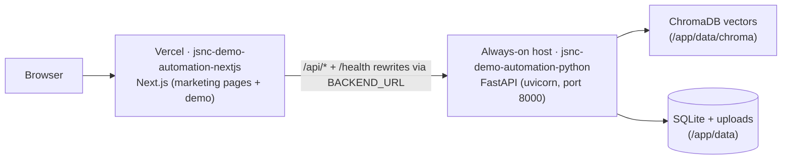

# Deployment Runbook — Two-Repo Vercel + Backend Host

> Applies after the 2026-09-04 repository split. Production ships as two
> repositories that talk by URL:
> - `jonathan-simpson-it/jsnc-demo-automation-nextjs` — Next.js app on **Vercel**
> - `jonathan-simpson-it/jsnc-demo-automation-python` — FastAPI backend on an
>   **always-on host with a persistent disk**
>
> This combined workspace repo is the dev workspace and archive for both.

## 1. Topology



Browsers only ever talk to the Next.js origin: `/api/*` and `/health` are
rewritten server-side by Next.js to the configured `BACKEND_URL`. No CORS
changes, no client-side URL knowledge; SSE streaming and uploads travel the
same proxy.

## 2. Repository layout after the split

- **python repo** (`jsnc-demo-automation-python`) owns the backend at its root:
  `config/ src/ tests/ scripts/ data/sample/ pyproject.toml run.sh .env.example
  Dockerfile .dockerignore README.md .gitignore`. Runtime state
  (`data/chroma/`, `*.db`, `*.db-shm`, `*.db-wal`, uploads, caches, `.env`) is
  gitignored and lives only on the host.
- **nextjs repo** (`jsnc-demo-automation-nextjs`) owns the frontend at its root:
  `frontend/` (the Next.js app), `scripts/fetch-regulator-logos.sh`, `.gitignore`,
  `README.md`. Vercel's Root Directory is `frontend`.

## 3. Deploy the Python backend (always-on host)

Pick any always-on host that gives you a persistent disk and a public URL
(Render, Railway, Fly.io, a VPS with Docker, an EC2 instance, ...). Vanilla
ephemeral serverless (e.g. Vercel Functions, Lambda without a mounted store) is
not suitable: the backend needs persistent ChromaDB/SQLite/uploads and runs an
in-process asyncio regulatory poll loop. SSE is fine from one long-lived
instance.

```bash
git clone https://github.com/jonathan-simpson-it/jsnc-demo-automation-python.git
cd jsnc-demo-automation-python
docker build -t pe-backend .
# Mount a persistent volume at /app/data and publish port 8000.
# Example (docker run):
docker volume create pe-data
docker run -d --name pe-backend \
  -p 8000:8000 \
  -v pe-data:/app/data \
  -e PORT=8000 \
  -e DEEPSEEK_API_KEY=... \
  pe-backend
```

Environment variables come from `python/.env.example` (`DEEPSEEK_API_KEY`,
`DEEPSEEK_MODEL`, `DEEPSEEK_TEMPERATURE`, `CHROMA_*`, chunking knobs, feature
flags in `config/settings.py`). On first boot with an empty volume, run the
ingest once so the vector store has the sample documents:

```bash
docker exec pe-backend python scripts/ingest.py
```

Health check: `curl https://<your-backend-host>/health` returns
`{"status":"healthy", ...}`.

## 4. Deploy Next.js on Vercel

1. Import `jonathan-simpson-it/jsnc-demo-automation-nextjs` into Vercel.
2. Set the Root Directory to `frontend`.
3. Add environment variables:
   - `BACKEND_URL` — the deployed Python backend URL (e.g.
     `https://api.your-backend-host.com`). Required in production; local dev
     defaults to `http://127.0.0.1:8000` when unset.
   - `NEXT_PUBLIC_SITE_URL` (optional) — site origin for metadata, canonical
     URLs, robots/sitemap. Defaults to `https://jonathansimpson.co`.
4. No `vercel.json` needed — the `/api/*` rewrites live in
   `frontend/next.config.js`.

The next.config.js warns at build time if `BACKEND_URL` is unset in production.

## 5. OAuth redirect URIs (OneDrive / Microsoft Graph)

Register the redirect URI on the Azure app registration. The API builds
redirect URIs from the request Host header, which behind the proxy is the
Next.js domain:

- Production: `https://<app-domain>/api/onedrive/callback`
- Local dev against the proxy: `http://localhost:3000/api/onedrive/callback`
- Local dev hitting the API directly: `http://localhost:8000/api/onedrive/callback`

## 6. BYOK and keys

- Browser users can bring their own DeepSeek key: the `X-API-Key` header
  travels unchanged through the Next.js proxy to the backend (stored only
  client-side).
- Set `DEEPSEEK_API_KEY` on the Python host only if you want a server-side
  fallback key.

## 7. Local development after the split

- **Python repo alone** (no sibling frontend): `./run.sh` auto-detects the
  missing frontend and runs API-only (`--api-only` still forces this), or run
  `uvicorn src.api.main:app --reload --port 8000`, or use the Dockerfile.
- **Next.js repo alone**: `cd frontend && npm install && npm run dev`. The
  default `BACKEND_URL` (`http://127.0.0.1:8000`) points at a locally running
  backend.
- **Combined workspace** (this repo): `cd python && ./run.sh` starts both
  tiers — FastAPI on 8000 and `../nextjs/frontend` on 3000.
