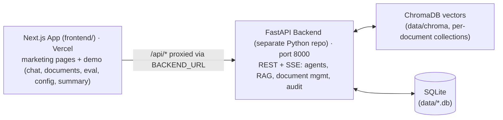

# Remove Astro, Consolidate on Next.js, Split Python Repo for Vercel — Implementation Plan

> **For agentic workers:** REQUIRED SUB-SKILL: Use superpowers:subagent-driven-development (recommended) or superpowers:executing-plans to implement this plan task-by-task. Steps use checkbox (`- [ ]`) syntax for tracking.

**Goal:** Delete the Astro marketing site (`web/`), serve every page (marketing + demo) from the Next.js app in `frontend/`, make the Next.js app talk to the FastAPI backend by URL via an env-driven `BACKEND_URL`, and prepare the backend to live in its own always-on-host repo — the final two-repo topology for Vercel deployment.

**Architecture:** Phase 1 ports the jonathansimpson.co marketing pages (services, work + 2 case studies, blog + 2 posts, products, applications, contact, support) 1:1 into `frontend/` as statically rendered App Router routes ("fast routes like Astro has" — same SSG behavior, no dynamic APIs), reusing the existing JS&C cream/sage design system already in `frontend/src/app/globals.css`, then deletes `web/`. Phase 2 parameterizes the backend proxy (`BACKEND_URL` env with a localhost default), adds a container deploy story for the backend, and documents the Vercel two-repo deployment. Phase 3 provides the gated ops recipe to split the Python backend into its own GitHub repo.

**Tech Stack:** Next.js 14 (App Router, TypeScript, Tailwind), existing FastAPI/LangGraph backend (unchanged), Docker for backend host, Vercel for Next.js. No new npm or pip dependencies.

**Spec:** Session decisions (2026-09-04): (1) remove the Astro project entirely — Next.js renders marketing pages statically; (2) host on Vercel as two repos — one Python, one Next.js — communicating via URLs; (3) port marketing pages into this Next.js app keeping the demo home at `/`; (4) 1:1 port of the current editorial design (no restyle); (5) Python backend runs as FastAPI+uvicorn on an always-on host with persistent disk, in its own repo. Supporting specs: `DESIGN-jonathansimpson.md`, `newDESIGN-nonai-look-non-rounded.md`, `docs/superpowers/plans/UIplan.md`.

## Global Constraints

- All diagrams in Mermaid (devano.md); no emojis in source or UI copy; provider-neutral copy.
- Marketing pages are a **1:1 port**: keep the Astro page content, data, and the JS&C editorial look (cream `#f4f4ef`, sage `#80988f`, serif display type). Do not restyle to the newer non-rounded demo look.
- No new dependencies. Ported pages render static at build — no `"use client"` except contact form / FAQ toggles, no dynamic APIs, no fetch on marketing routes.
- Demo routes untouched except: Header/Footer nav sets become context-aware, and the two external `https://jonathansimpson.co/...` CTAs in the demo home become internal links.
- Frontend verification standard (repo convention): `cd frontend && npx tsc --noEmit` then `npm run build` clean; backend pytest suite stays green; Playwright/curl smoke of new routes on `localhost:3000`.
- Backend Python code modified only by deploy artifacts (`Dockerfile`, `.dockerignore`) and docs.
- Keep `web/` untouched until its last task deletes it; every deleted route must be served from `frontend/` first.

---

## File Structure Map

New files (Phase 1): `frontend/src/content/site.ts`, `frontend/src/content/blog.ts`, `frontend/src/content/projects.ts`, `frontend/src/lib/dates.ts`, `frontend/src/components/marketing/{SectionIntro,ChipList,CtaBand,MarketingProse,RegulatorLogosFigure,ContactForm,SupportFaq}.tsx`, routes `frontend/src/app/{services,products,applications,contact,support}/page.tsx`, `frontend/src/app/work/page.tsx`, `frontend/src/app/work/[slug]/page.tsx`, `frontend/src/app/blog/page.tsx`, `frontend/src/app/blog/[slug]/page.tsx`, `frontend/src/app/robots.ts`, `frontend/src/app/sitemap.ts`, `Dockerfile`, `.dockerignore`, `docs/deploy.md`.

Modified: `frontend/next.config.js`, `frontend/.env.example`, `frontend/src/app/layout.tsx`, `frontend/src/app/globals.css` (append), `frontend/src/components/{Header,Footer}.tsx`, `frontend/src/app/page.tsx`, `frontend/src/components/PitchBand.tsx`, `frontend/public/pictures/README.md`, `.gitignore`, `scripts/fetch-regulator-logos.sh`, `README.md`. Deleted: `web/` entirely.

---

## Phase 1 — Port the Astro marketing site into Next.js

### Task 1: Marketing content modules

**Files:** Create `frontend/src/content/site.ts`, `frontend/src/content/blog.ts`, `frontend/src/content/projects.ts`, `frontend/src/lib/dates.ts`

**Interfaces:** Produces `siteConfig`, `BlogPost { slug, title, description, pubDate, author, tags, body }`, `ProjectCase { slug, title, client, description, pubDate, tags, featured, body }`, `getBlogPosts(): BlogPost[]`, `getBlogPost(slug)`, `getProjects()`, `getProject(slug)`, `formatLongDate(iso: string)`. All content copied verbatim from the Astro files.

- [ ] **Step 1: Create `frontend/src/content/site.ts`**

```ts
/** Marketing site data, ported verbatim from web/src/data/siteConfig.ts and
    the web/src/pages/*.astro page arrays on 2026-09-04 (Astro removed). */

export interface NavItem {
  label: string;
  href: string;
}
export interface Blurb {
  title: string;
  description: string;
  tags: string[];
}
export interface Product extends Blurb {
  status: string;
}
export interface Faq {
  q: string;
  a: string;
}

export const siteConfig = {
  brandName: "Jonathan Simpson & Co.",
  brandTagline:
    "We build digital systems that move money, manage risk, and scale operations for growth-stage companies.",
  siteTitle: "Jonathan Simpson & Co. — Digital Strategy & Engineering",
  siteDescription: "Strategy, design, and engineering for companies that move money.",
  siteUrl: process.env.NEXT_PUBLIC_SITE_URL ?? "https://jonathansimpson.co",
  // Marketing nav shown in the header while browsing marketing routes.
  marketingNavigation: [
    { label: "Services", href: "/services" },
    { label: "Work", href: "/work" },
    { label: "Blog", href: "/blog" },
    { label: "Products", href: "/products" },
    { label: "Applications", href: "/applications" },
    { label: "Contact", href: "/contact" },
  ],
  // Marketing routes — used by Header/Footer/sitemap to decide context.
  marketingPaths: [
    "/services",
    "/work",
    "/blog",
    "/products",
    "/applications",
    "/contact",
    "/support",
  ],
  socialLinks: [
    { label: "LinkedIn", href: "https://www.linkedin.com/company/jonathan-simpson-co" },
  ],
  services: [
    {
      phase: "01",
      title: "Strategy & Architecture",
      description:
        "We audit your existing systems, map workflows, and design technology that fits your operations.",
      details: [
        "Current-state technology audit",
        "Workflow mapping and bottleneck analysis",
        "Technology selection and architecture design",
        "Implementation roadmap with milestones",
      ],
      tags: ["Discovery", "Architecture", "Roadmap"],
    },
    {
      phase: "02",
      title: "Design & Build",
      description: "From wireframe to production. We design interfaces your team will actually use.",
      details: [
        "UI/UX design with user research",
        "Full-stack development (Python, TypeScript, React)",
        "API design and integration",
        "Automated testing and CI/CD",
      ],
      tags: ["UI/UX", "Full-Stack", "APIs"],
    },
    {
      phase: "03",
      title: "Deploy & Iterate",
      description: "CI/CD pipelines, monitoring, training. We don't hand off and disappear.",
      details: [
        "Cloud infrastructure setup (AWS, GCP, Azure)",
        "CI/CD pipeline configuration",
        "Team training and documentation",
        "Ongoing support and iteration",
      ],
      tags: ["DevOps", "Training", "Support"],
    },
  ],
  capabilities: [
    {
      title: "Private Equity Workflow Automation",
      description:
        "Term-sheet analysis, covenant monitoring, LP reporting — retrieval-grounded AI that your team actually trusts.",
      tags: ["RAG", "Multi-Agent", "Grounded Answers"],
    },
    {
      title: "Regulatory Compliance Systems",
      description:
        "SFC, HKMA and AMLO-aware compliance built into your tools — with audit trails, explainability exports, and human review.",
      tags: ["Audit", "Explainability", "Human Review"],
    },
    {
      title: "Financial Operations Platforms",
      description: "Cash flow forecasting, multi-currency handling, document management.",
      tags: ["Forecasting", "Multi-Currency", "Documents"],
    },
    {
      title: "Data Engineering & Analytics",
      description: "From raw data to decision-ready dashboards.",
      tags: ["Pipelines", "Warehousing", "Dashboards"],
    },
  ],
  processSteps: [
    { number: "01", title: "Discovery", description: "Audit existing systems, understand workflows, identify bottlenecks." },
    { number: "02", title: "Strategy", description: "Define success metrics, choose technology, plan architecture." },
    { number: "03", title: "Design", description: "Wireframe → high-fidelity mockup → prototype. Iterative, client-reviewed." },
    { number: "04", title: "Build", description: "Production-grade code, CI/CD pipelines, automated testing." },
    { number: "05", title: "Launch & Iterate", description: "Deploy, monitor, train team, continuous improvement." },
  ],
  products: [
    {
      title: "PE AI Engineering Platform",
      description:
        "A production-grade AI workspace for private-equity firms: retrieval-grounded answers, human review, and a tamper-evident audit trail. A live demo ships with every engagement.",
      tags: ["Live demo", "Multi-agent", "Audit-ready"],
      status: "In Production",
    },
    {
      title: "Compliance Toolkit",
      description:
        "Compliance infrastructure your regulators expect: immutable audit trails, PII redaction, explainability exports, and jurisdiction-aware checks — SFC, HKMA and AMLO first.",
      tags: ["Audit Trail", "PII Redaction", "SFC · HKMA · AMLO"],
      status: "In Production",
    },
    {
      title: "Financial Operations Suite",
      description:
        "Covenant monitoring, cash-flow forecasting, and multi-currency handling — the operational layer behind the numbers.",
      tags: ["Forecasting", "Multi-Currency", "Monitoring"],
      status: "Beta",
    },
  ],
  applications: [
    { title: "AI Chat Interface", description: "Natural-language analysis of your documents with cited, reviewable answers.", tags: ["SSE Streaming", "Multi-Agent", "Real-time"] },
    { title: "Document Manager", description: "Upload, manage, and browse the knowledge base.", tags: ["Drag & Drop", "Auto-Summary", "Version Control"] },
    { title: "Eval Dashboard", description: "View accuracy metrics across 180 test questions.", tags: ["180 Questions", "Per-Doc Metrics", "Pipeline Trace"] },
    { title: "Pipeline Inspector", description: "Transparent breakdown: agent routing, execution path, per-node timing.", tags: ["Confidence", "Citations", "Timing"] },
  ],
  faqs: [
    { q: "What types of financial institutions do you work with?", a: "We work with growth-stage financial institutions including mid-market PE firms, regional banks, fund administrators, and licensed corporations across Hong Kong, Singapore, and London." },
    { q: "How long does a typical engagement take?", a: "Most projects run 8-16 weeks from discovery to production deployment." },
    { q: "Do you work with existing technology stacks?", a: "Yes. We audit your current systems and design solutions that integrate with what you already have." },
    { q: "What about data security and compliance?", a: "Every system we build includes audit trails, PII redaction, RBAC, and compliance controls as first-class features." },
    { q: "Can you support systems after launch?", a: "Yes. We offer ongoing support and iteration contracts." },
    { q: "What technologies do you use?", a: "Python (LangGraph, LangChain, FastAPI), TypeScript (Next.js, React), ChromaDB, DeepSeek API, and cloud platforms." },
  ],
  contactInfo: {
    email: "hello@jonathansimpson.co",
    region: "We work with growth-stage financial institutions across Hong Kong, Singapore, and London.",
  },
  cta: {
    headline: "Ready to eliminate operational friction?",
    description: "We help financial institutions automate the workflows that slow them down.",
    buttonText: "Start a project",
    buttonHref: "/contact",
  },
  seo: {
    defaultTitle: "Jonathan Simpson & Co. — Digital Strategy & Engineering",
    defaultDescription: "Strategy, design, and engineering for companies that move money.",
  },
} as const;
```

- [ ] **Step 2: Create `frontend/src/content/blog.ts`**

```ts
/** Blog posts ported verbatim from web/src/content/blog/*.md (2026-09-04).
    Bodies keep their original markdown; MarketingProse renders the subset
    actually used. The compliance post's inline logo figure becomes the
    [[regulator-logos]] token. */

export interface BlogPost {
  slug: string;
  title: string;
  description: string;
  pubDate: string; // ISO date, e.g. "2026-09-01"
  author: string;
  tags: string[];
  body: string;
}

export const BLOG_POSTS: BlogPost[] = [
  {
    slug: "ai-in-pe-due-diligence",
    title: "Why PE Deal Teams Need AI-Native Workflows",
    description: "The case for building AI into the deal process from day one.",
    pubDate: "2026-09-01",
    author: "Jonathan Simpson",
    tags: ["Private Equity", "AI", "Workflow Automation"],
    body: `Private equity deal teams spend 60% of their time on repetitive document analysis. Term sheet extraction, covenant monitoring, LP reporting — these are pattern-matching tasks that machines do better than humans.

Yet most firms still rely on spreadsheets and manual review.

The difference between "AI-assisted" and "AI-native" is architectural. AI-assisted means you paste a document into ChatGPT. AI-native means the AI is woven into your document management, reporting, and compliance systems — running automatically, consistently, with full audit trails.

Our PE AI Engineering Platform uses LangGraph to orchestrate specialized agents for due diligence, term sheet extraction, compliance checking, and LP reporting. After deploying for a mid-market PE firm:

- **80% reduction** in manual data entry
- **3x faster** LP report generation
- **Zero compliance misses** in 6 months

AI in PE isn't about replacing analysts. It's about eliminating the 3 hours of manual morning data pulls so analysts can focus on judgment and deal strategy.`,
  },
  {
    slug: "building-compliance-from-day-one",
    title: "Building Compliance Into AI Systems",
    description: "Why HKMA and SFC compliance should be a first-class architectural concern.",
    pubDate: "2026-08-15",
    author: "Jonathan Simpson",
    tags: ["Compliance", "HKMA", "SFC", "Architecture"],
    body: `Most AI systems treat compliance as a wrapper. Build the system, then add logging and audit trails after. This fails because bolt-on compliance misses edge cases — PII leaking through cache, audit gaps in streaming responses, model version drift.

When we build AI systems for SME financial institutions, compliance is Layer 0.

[[regulator-logos]]

**Immutable Audit Trail** — Every query logged with SHA-256 hash chain. Tamper-evident without external dependencies.

**PII Redaction** — Before data touches logs, cache, or exports, our redaction layer detects and masks emails, HKIDs, phone numbers, bank accounts, and credit cards.

**Model Version Pinning** — HKMA requires firms to freeze model versions. Our system tracks model name, version, config hash, and deployment timestamp.

**Document-Level RBAC** — Not just "who can query" but "who can query which documents."

A system that's compliant by construction, not by exception.`,
  },
];

export function getBlogPosts(): BlogPost[] {
  return [...BLOG_POSTS].sort(
    (a, b) => new Date(b.pubDate).valueOf() - new Date(a.pubDate).valueOf(),
  );
}

export function getBlogPost(slug: string): BlogPost | undefined {
  return BLOG_POSTS.find((p) => p.slug === slug);
}
```

- [ ] **Step 3: Create `frontend/src/content/projects.ts`**

```ts
/** Case studies ported verbatim from web/src/content/projects/*.md
    (2026-09-04). Bodies keep their original markdown. */

export interface ProjectCase {
  slug: string;
  title: string;
  client: string;
  description: string;
  pubDate: string;
  tags: string[];
  featured: boolean;
  body: string;
}

export const PROJECTS: ProjectCase[] = [
  {
    slug: "pe-deal-flow-automation",
    title: "PE Deal Flow Automation",
    client: "Mid-Market PE Firm",
    description:
      "Automated term sheet analysis, covenant monitoring, and LP reporting for a 12-person deal team.",
    pubDate: "2026-08-01",
    tags: ["LangGraph", "RAG", "Compliance", "Automation"],
    featured: true,
    body: `## The Challenge

A mid-market PE firm was drowning in manual document processing. Their 12-person deal team spent 40% of their time on repetitive tasks.

## What We Built

A multi-agent AI system that automates the entire document analysis pipeline:

- **Term Sheet Analysis** — Extracts 19 structured fields from financing documents
- **Covenant Monitoring** — Tracks debt/EBITDA and current ratio against thresholds
- **LP Reporting** — Pulls data from multiple sources, generates quarterly reports

## Results

| Metric | Before | After |
|--------|--------|-------|
| Term sheet analysis | 2 hours | 15 minutes |
| LP report generation | 3 days | 4 hours |
| Compliance misses | 2-3 per quarter | 0 |
| Manual data entry | 60% of team time | <10% |`,
  },
  {
    slug: "sme-lending-platform",
    title: "SME Lending Platform",
    client: "Regional Bank",
    description:
      "Credit assessment platform with automated PII redaction, audit trails, and jurisdiction-aware compliance.",
    pubDate: "2026-07-15",
    tags: ["FastAPI", "RBAC", "Audit Trail", "Compliance"],
    featured: false,
    body: `## The Challenge

A regional bank was processing SME loan applications manually. Credit analysts spent hours reviewing financial statements and checking compliance across jurisdictions.

## What We Built

- **Automated Document Analysis** — Upload financial statements, KYC documents, loan applications
- **Compliance Engine** — Jurisdiction-aware regulatory checks, PII redaction, immutable audit trail
- **Credit Assessment** — Automated covenant checking, cash flow forecasting, risk scoring

## Results

| Metric | Before | After |
|--------|--------|-------|
| Application processing | 5 days | 4 hours |
| Compliance check coverage | 60% | 100% |
| PII exposure risk | High | Near-zero |`,
  },
];

export function getProjects(): ProjectCase[] {
  return [...PROJECTS].sort(
    (a, b) => new Date(b.pubDate).valueOf() - new Date(a.pubDate).valueOf(),
  );
}

export function getProject(slug: string): ProjectCase | undefined {
  return PROJECTS.find((p) => p.slug === slug);
}
```

- [ ] **Step 4: Create `frontend/src/lib/dates.ts`**

```ts
/** Long-form date, e.g. "September 1, 2026" (matches the Astro site's
    toLocaleDateString("en-US", { year, month, day })) and ISO date input. */
export function formatLongDate(iso: string): string {
  return new Date(iso).toLocaleDateString("en-US", {
    year: "numeric",
    month: "long",
    day: "numeric",
  });
}
```

- [ ] **Step 5: Verify** — Run `cd frontend && npx tsc --noEmit`. Expected: PASS.
- [ ] **Step 6: Commit**

```bash
git add frontend/src/content/site.ts frontend/src/content/blog.ts frontend/src/content/projects.ts frontend/src/lib/dates.ts
git commit -m "feat(site): port Astro marketing data into typed Next.js content modules"
```

### Task 2: Marketing primitives and prose renderer

**Files:** Create `frontend/src/components/marketing/{SectionIntro,ChipList,CtaBand,MarketingProse,RegulatorLogosFigure}.tsx`

**Interfaces:** Produces `<SectionIntro eyebrow title description?>`, `<ChipList tags>`, `<CtaBand />`, `<MarketingProse text>`, `RegulatorLogosFigure`. All server components. Visual treatment copied from `web/src/components/*.astro` and `web/src/styles/global.css`.

- [ ] **Step 1: Create the three primitives**

```tsx
// SectionIntro.tsx
interface Props {
  eyebrow: string;
  title: string;
  description?: string;
}

export default function SectionIntro({ eyebrow, title, description }: Props) {
  return (
    <div className="section-intro">
      <span className="section-eyebrow">{eyebrow}</span>
      <h2
        style={{
          fontFamily: "var(--font-display)",
          fontSize: "var(--text-h2)",
          fontWeight: 400,
          letterSpacing: "-0.01em",
          lineHeight: 1.2,
          margin: "0 0 1rem",
        }}
      >
        {title}
      </h2>
      {description && <p>{description}</p>}
    </div>
  );
}
```

```tsx
// ChipList.tsx
interface Props {
  tags: string[];
}

export default function ChipList({ tags }: Props) {
  return (
    <ul className="chip-list" role="list">
      {tags.map((tag) => (
        <li key={tag}>{tag}</li>
      ))}
    </ul>
  );
}
```

```tsx
// CtaBand.tsx
import { siteConfig } from "@/content/site";

export default function CtaBand() {
  const { headline, description, buttonText, buttonHref } = siteConfig.cta;
  return (
    <section className="cta-band marketing-cta">
      <div className="container">
        <h2
          style={{
            fontFamily: "var(--font-display)",
            fontSize: "var(--text-h2)",
            fontWeight: 400,
            letterSpacing: "-0.01em",
            lineHeight: 1.2,
            color: "var(--color-surface)",
            margin: "0 0 1rem",
          }}
        >
          {headline}
        </h2>
        <p>{description}</p>
        <a className="button button--ghost" href={buttonHref}>
          {buttonText}
        </a>
      </div>
    </section>
  );
}
```

- [ ] **Step 2: Create `RegulatorLogosFigure.tsx`** (port of the inline `<figure>` from the "Building Compliance" post)

```tsx
/** Regulator logo marks used in the "Building Compliance" post. Logos belong
    to their owners and identify official sources. */
export default function RegulatorLogosFigure() {
  return (
    <figure
      style={{
        display: "flex",
        gap: "1.5rem",
        alignItems: "center",
        margin: "2rem 0",
        background: "var(--color-surface)",
        border: "1px solid var(--color-line)",
        borderRadius: "var(--radius-lg)",
        padding: "1.5rem",
        flexWrap: "wrap",
      }}
    >
      <a href="https://www.sfc.hk/en/" target="_blank" rel="noopener noreferrer">
        {/* eslint-disable-next-line @next/next/no-img-element */}
        
      </a>
      <a href="https://www.hkma.gov.hk/eng/" target="_blank" rel="noopener noreferrer">
        {/* eslint-disable-next-line @next/next/no-img-element */}
        
      </a>
      <figcaption
        style={{ fontSize: "0.8rem", color: "var(--color-muted)", lineHeight: 1.5, flex: 1, minWidth: "12rem" }}
      >
        We build compliance-first systems against the standards these regulators
        publish. Logos belong to their owners and identify official sources.
      </figcaption>
    </figure>
  );
}
```

- [ ] **Step 3: Create `MarketingProse.tsx`** — markdown-lite renderer for the exact subset used by the 4 bodies (`## `, paragraphs, `**bold**`, `_italic_`, `- ` bullets, `|` tables, `[[regulator-logos]]` token), modeled on the existing `EmailPreview.tsx` parser pattern:

```tsx
import type { ReactNode } from "react";
import RegulatorLogosFigure from "./RegulatorLogosFigure";

const BOLD_RE = /\*\*(.+?)\*\*/g;
const ITALIC_RE = /_([^_]+)_/g;

function renderInline(raw: string, keyBase = "x"): ReactNode {
  const nodes: ReactNode[] = [];
  const re = new RegExp(BOLD_RE.source, "g");
  let last = 0;
  let key = 0;
  let m: RegExpExecArray | null;
  while ((m = re.exec(raw)) !== null) {
    if (m.index > last)
      nodes.push(renderItalic(raw.slice(last, m.index), `${keyBase}i${key}`));
    nodes.push(
      <strong key={`${keyBase}b${key++}`}>{renderItalic(m[1], `${keyBase}ib`)}</strong>,
    );
    last = m.index + m[0].length;
  }
  if (last < raw.length) nodes.push(renderItalic(raw.slice(last), `${keyBase}t${key}`));
  return nodes.length ? nodes : [renderItalic(raw, `${keyBase}o`)];
}

function renderItalic(raw: string, keyBase: string): ReactNode {
  const parts = raw.split(ITALIC_RE);
  if (parts.length === 1) return raw;
  const out: ReactNode[] = [];
  parts.forEach((part, i) => {
    if (i % 2 === 1) out.push(<em key={`${keyBase}${i}`}>{part}</em>);
    else if (part) out.push(part);
  });
  return out.length ? <>{out}</> : raw;
}

function parseTable(lines: string[]): string[][] {
  const cells = (line: string) =>
    line.replace(/^\||\|$/g, "").split("|").map((c) => c.trim());
  const rows: string[][] = [];
  for (const line of lines) {
    if (/^\s*\|?[\s:|-]+\|?\s*$/.test(line) && line.includes("-")) continue;
    rows.push(cells(line));
  }
  return rows;
}

/** Renders the markdown bodies stored in frontend/src/content/. */
export default function MarketingProse({ text }: { text: string }) {
  const lines = text.split("\n");
  const blocks: ReactNode[] = [];
  let key = 0;
  let i = 0;

  while (i < lines.length) {
    const line = lines[i].trimEnd();
    if (!line.trim()) { i++; continue; }
    if (line.startsWith("[[regulator-logos]]")) {
      blocks.push(<RegulatorLogosFigure key={`fig${key++}`} />);
      i++;
      continue;
    }
    if (line.startsWith("## ")) {
      blocks.push(
        <h2 key={`h2${key++}`} style={{ fontFamily: "var(--font-display)", fontSize: "var(--text-h2)", fontWeight: 400, letterSpacing: "-0.01em", lineHeight: 1.2, margin: "2.5rem 0 1rem", color: "var(--color-ink)" }}>
          {renderInline(line.slice(3), `h2${key}`)}
        </h2>,
      );
      i++;
      continue;
    }
    if (line.startsWith("|")) {
      const tableLines: string[] = [];
      while (i < lines.length && lines[i].trimStart().startsWith("|")) {
        tableLines.push(lines[i]);
        i++;
      }
      const rows = parseTable(tableLines);
      if (rows.length) {
        const [head, ...body] = rows;
        blocks.push(
          <div key={`t${key++}`} style={{ overflowX: "auto", margin: "1.5rem 0" }}>
            <table style={{ width: "100%", borderCollapse: "collapse", fontSize: "0.88rem" }}>
              <thead>
                <tr>
                  {head.map((c, ci) => (
                    <th key={ci} style={{ textAlign: "left", padding: "0.5rem 0.75rem", borderBottom: "1px solid var(--color-ink)", color: "var(--color-ink)", fontWeight: 600 }}>
                      {renderInline(c, `th${ci}`)}
                    </th>
                  ))}
                </tr>
              </thead>
              <tbody>
                {body.map((row, ri) => (
                  <tr key={ri}>
                    {row.map((c, ci) => (
                      <td key={ci} style={{ padding: "0.5rem 0.75rem", borderBottom: "1px solid var(--color-line)", verticalAlign: "top" }}>
                        {renderInline(c, `td${ri}-${ci}`)}
                      </td>
                    ))}
                  </tr>
                ))}
              </tbody>
            </table>
          </div>,
        );
      }
      continue;
    }
    if (line.startsWith("- ")) {
      const items: ReactNode[] = [];
      while (i < lines.length && lines[i].trim().startsWith("- ")) {
        items.push(
          <li key={`li${key++}`} style={{ marginBottom: "0.5rem" }}>
            {renderInline(lines[i].trim().slice(2), `li${key}`)}
          </li>,
        );
        i++;
      }
      blocks.push(
        <ul key={`ul${key++}`} style={{ paddingLeft: "1.5rem", margin: "0 0 1.25rem" }}>
          {items}
        </ul>,
      );
      continue;
    }
    blocks.push(
      <p key={`p${key++}`} style={{ margin: "0 0 1.25rem" }}>
        {renderInline(line, `p${key}`)}
      </p>,
    );
    i++;
  }

  return <div className="prose">{blocks}</div>;
}
```

- [ ] **Step 4: Verify** — `cd frontend && npx tsc --noEmit`. Expected: PASS.
- [ ] **Step 5: Commit**

```bash
git add frontend/src/components/marketing
git commit -m "feat(site): marketing section primitives and markdown-lite prose renderer"
```

### Task 3: Marketing CSS block in globals.css

**Files:** Modify `frontend/src/app/globals.css` (append one block)

**Interfaces:** Produces classes used by Tasks 4-8: `.marketing-page .section-intro`, `.chip-list`, `.grid-services`, `.grid-capabilities`, `.grid-blog`, `.grid-contact`, `.marketing-card-link`, `.prose`, `.back-link`, `.cta-band` (+ ghost-button overrides), `.contact-form-field`, `.faq-row`. `.section`, `.section-eyebrow`, `.panel-card`, `.button`, `.container` already exist — check first, never duplicate.

- [ ] **Step 1: Check existing selectors**

Run: `rg -n '^\.(chip-list|grid-blog|grid-services|grid-capabilities|grid-contact|prose|cta-band|marketing-cta|page-content)\b|^\.section\b|^\.section-eyebrow\b' frontend/src/app/globals.css`
Expected: `.section`/`.section-eyebrow` present; the rest absent. Skip any rule whose selector is already defined.

- [ ] **Step 2: Append to `frontend/src/app/globals.css`**

```css
/* ============================================================
   Marketing pages (ported 1:1 from the Astro site, 2026-09-04)
   ============================================================ */

/* Intro spacing */
.marketing-page .section-intro {
  margin-bottom: clamp(2rem, 4vw, 3.5rem);
}
.marketing-page .section-intro p {
  font-size: var(--text-body);
  max-width: 40rem;
}

/* Chip rows (cards: services, work, blog, products, applications) */
.chip-list {
  display: flex;
  flex-wrap: wrap;
  gap: 0.5rem;
  list-style: none;
  padding-left: 0;
}
.chip-list li {
  display: inline-block;
  padding: 0.35rem 0.85rem;
  background: var(--color-accent-soft);
  border: 1px solid var(--color-line);
  border-radius: 999px;
  font-size: 0.74rem;
  color: var(--color-muted);
}

/* Card grids */
.grid-services {
  display: grid;
  grid-template-columns: repeat(auto-fit, minmax(16rem, 1fr));
  gap: 1rem;
}
.grid-capabilities {
  display: grid;
  grid-template-columns: repeat(auto-fit, minmax(15rem, 1fr));
  gap: 1rem;
}
.grid-blog {
  display: grid;
  grid-template-columns: repeat(2, 1fr);
  gap: 1.5rem;
}
@media (max-width: 768px) {
  .grid-blog {
    grid-template-columns: 1fr;
  }
}
.grid-contact {
  display: grid;
  grid-template-columns: minmax(16rem, 1fr) minmax(26rem, 1.8fr);
  gap: 2rem;
}
@media (max-width: 768px) {
  .grid-contact {
    grid-template-columns: 1fr;
  }
}

/* Card links (work/blog cards link to detail pages) */
.marketing-card-link {
  display: block;
  text-decoration: none;
}
.marketing-card-link .panel-card {
  height: 100%;
}

/* Prose (article bodies) */
.prose {
  max-width: 45rem;
  font-size: var(--text-body);
  color: var(--color-muted);
}
.prose p {
  margin-bottom: 1.25rem;
  line-height: 1.65;
}
.prose ul,
.prose ol {
  padding-left: 1.5rem;
  margin-bottom: 1.25rem;
}
.prose li {
  margin-bottom: 0.5rem;
  color: var(--color-muted);
}

/* Back-to-list link on detail pages */
.back-link {
  font-size: var(--text-small);
  text-transform: uppercase;
  letter-spacing: 0.06em;
  color: var(--color-accent);
  text-decoration: none;
}
.back-link:hover {
  color: var(--color-ink);
}

/* CTA band (dark) */
.cta-band {
  background: var(--color-ink);
  color: var(--color-surface);
  padding: clamp(3rem, 6vw, 5rem) 0;
  text-align: center;
  margin-top: clamp(3rem, 6vw, 5rem);
}
.cta-band p {
  color: rgba(255, 255, 255, 0.7);
  margin-inline: auto;
  margin-bottom: 2rem;
  max-width: 40rem;
}
.cta-band .button--ghost {
  background: rgba(255, 255, 255, 0.1);
  color: var(--color-surface);
  border-color: rgba(255, 255, 255, 0.2);
}
.cta-band .button--ghost:hover {
  background: var(--color-accent);
  color: var(--color-surface);
  border-color: var(--color-accent);
}

/* Contact form fields (scoped to the marketing contact page) */
.contact-form-field input,
.contact-form-field textarea {
  font-family: var(--font-body);
  font-size: var(--text-body);
  color: var(--color-ink);
  background: var(--color-surface);
  border: 1px solid var(--color-line);
  border-radius: var(--radius-md);
  padding: 0.75rem 1rem;
  width: 100%;
  transition: border-color var(--transition-fast);
}
.contact-form-field input:focus,
.contact-form-field textarea:focus {
  outline: none;
  border-color: var(--color-accent);
}
.contact-form-field textarea {
  resize: vertical;
  min-height: 120px;
}
.contact-form-field label {
  display: block;
  font-size: var(--text-small);
  font-weight: 500;
  color: var(--color-ink);
  margin-bottom: 0.5rem;
}

/* Support FAQ details rows */
.faq-row summary {
  font-weight: 500;
  cursor: pointer;
  color: var(--color-ink);
  list-style: none;
  display: flex;
  justify-content: space-between;
  align-items: center;
  gap: 1rem;
}
.faq-row summary::-webkit-details-marker {
  display: none;
}
```

- [ ] **Step 3: Verify** — `cd frontend && npx tsc --noEmit && npm run build`. Expected: PASS.
- [ ] **Step 4: Commit**

```bash
git add frontend/src/app/globals.css
git commit -m "style(site): marketing page styles ported from Astro global.css"
```

### Task 4: Static marketing pages (services, products, applications)

**Files:** Create `frontend/src/app/services/page.tsx`, `frontend/src/app/products/page.tsx`, `frontend/src/app/applications/page.tsx`

**Interfaces:** Consumes `siteConfig`, `SectionIntro`, `ChipList`, `CtaBand`. Produces static routes `/services`, `/products`, `/applications` with `Metadata`. Content and layout follow the Astro originals exactly.

- [ ] **Step 1: Create `frontend/src/app/services/page.tsx`**

```tsx
import type { Metadata } from "next";
import SectionIntro from "@/components/marketing/SectionIntro";
import ChipList from "@/components/marketing/ChipList";
import CtaBand from "@/components/marketing/CtaBand";
import { siteConfig } from "@/content/site";

export const metadata: Metadata = {
  title: "Services — Jonathan Simpson & Co.",
  description: "Strategy, design, and engineering for companies that move money.",
};

export default function ServicesPage() {
  return (
    <div className="marketing-page">
      <section className="section">
        <div className="container">
          <SectionIntro
            eyebrow="Services"
            title="What we do"
            description="Three phases. One team. From strategy to production."
          />
          <div style={{ display: "grid", gap: "2rem" }}>
            {siteConfig.services.map((s, i) => (
              <div className="panel-card" key={s.title}>
                <div style={{ display: "grid", gridTemplateColumns: "1fr 1fr", gap: "2rem", alignItems: "start" }}>
                  <div>
                    <span className="section-eyebrow">Phase {String(i + 1).padStart(2, "0")}</span>
                    <h3 style={{ fontSize: "var(--text-h2)", fontFamily: "var(--font-display)", fontWeight: 400, margin: "0 0 1rem" }}>
                      {s.title}
                    </h3>
                    <p style={{ margin: "0 0 1.5rem" }}>{s.description}</p>
                    <ChipList tags={s.tags} />
                  </div>
                  <div>
                    <h4 style={{ fontSize: "0.85rem", fontWeight: 600, letterSpacing: "0.07em", textTransform: "uppercase", margin: "0 0 1rem" }}>
                      Includes
                    </h4>
                    <ul style={{ listStyle: "none", padding: 0 }}>
                      {s.details.map((d) => (
                        <li key={d} style={{ padding: "0.5rem 0", borderBottom: "1px solid var(--color-line)", color: "var(--color-muted)" }}>
                          {d}
                        </li>
                      ))}
                    </ul>
                  </div>
                </div>
              </div>
            ))}
          </div>
        </div>
      </section>
      <CtaBand />
    </div>
  );
}
```

Note: the Astro sections used `page-content` top padding because its header was fixed/transparent; this app's header is in-flow, so `.section` alone is correct.

- [ ] **Step 2: Create `frontend/src/app/products/page.tsx` and `applications/page.tsx`** — identical skeleton to Step 1 with the data + copy from the Astro originals:

```tsx
// frontend/src/app/products/page.tsx
import type { Metadata } from "next";
import SectionIntro from "@/components/marketing/SectionIntro";
import ChipList from "@/components/marketing/ChipList";
import CtaBand from "@/components/marketing/CtaBand";
import { siteConfig } from "@/content/site";

export const metadata: Metadata = {
  title: "Products — Jonathan Simpson & Co.",
  description: "Software products for financial operations.",
};

export default function ProductsPage() {
  return (
    <div className="marketing-page">
      <section className="section">
        <div className="container">
          <SectionIntro
            eyebrow="Products"
            title="What we've built"
            description="Software tools born from real client work."
          />
          <div className="grid-services">
            {siteConfig.products.map((p) => (
              <div className="panel-card" key={p.title}>
                <span className="section-eyebrow">{p.status}</span>
                <h3 style={{ margin: 0 }}>{p.title}</h3>
                <p style={{ margin: "0.75rem 0 1rem" }}>{p.description}</p>
                <ChipList tags={p.tags} />
              </div>
            ))}
          </div>
        </div>
      </section>
      <CtaBand />
    </div>
  );
}
```

```tsx
// frontend/src/app/applications/page.tsx
import type { Metadata } from "next";
import SectionIntro from "@/components/marketing/SectionIntro";
import ChipList from "@/components/marketing/ChipList";
import CtaBand from "@/components/marketing/CtaBand";
import { siteConfig } from "@/content/site";

export const metadata: Metadata = {
  title: "Applications — Jonathan Simpson & Co.",
  description: "Interactive applications built on our PE AI Platform.",
};

export default function ApplicationsPage() {
  return (
    <div className="marketing-page">
      <section className="section">
        <div className="container">
          <SectionIntro
            eyebrow="Applications"
            title="Interactive tools"
            description="Every application below runs live — we'll walk you through it on your own documents."
          />
          <div className="grid-services">
            {siteConfig.applications.map((a) => (
              <div className="panel-card" key={a.title}>
                <h3 style={{ margin: 0 }}>{a.title}</h3>
                <p style={{ margin: "0.75rem 0 1rem" }}>{a.description}</p>
                <ChipList tags={a.tags} />
              </div>
            ))}
          </div>
        </div>
      </section>
      <CtaBand />
    </div>
  );
}
```

- [ ] **Step 3: Verify** — `cd frontend && npx tsc --noEmit && npm run build`. Expected: PASS; the three routes appear as `○ (Static)`.
- [ ] **Step 4: Commit**

```bash
git add frontend/src/app/services frontend/src/app/products frontend/src/app/applications
git commit -m "feat(site): port services, products and applications pages to Next.js"
```

### Task 5: Work and blog listing + detail pages

**Files:** Create `frontend/src/app/work/page.tsx`, `frontend/src/app/work/[slug]/page.tsx`, `frontend/src/app/blog/page.tsx`, `frontend/src/app/blog/[slug]/page.tsx`

**Interfaces:** Consumes `getProjects()/getProject()`, `getBlogPosts()/getBlogPost()`, `formatLongDate()`, `MarketingProse`, `SectionIntro`, `ChipList`, `CtaBand`. Produces `/work`, `/work/[slug]`, `/blog`, `/blog/[slug]` as SSG routes (`generateStaticParams` mirrors Astro `getStaticPaths`) with per-page metadata and Article/BlogPosting JSON-LD.

- [ ] **Step 1: Create `frontend/src/app/work/page.tsx`**

```tsx
import type { Metadata } from "next";
import SectionIntro from "@/components/marketing/SectionIntro";
import ChipList from "@/components/marketing/ChipList";
import CtaBand from "@/components/marketing/CtaBand";
import { getProjects } from "@/content/projects";

export const metadata: Metadata = {
  title: "Work — Jonathan Simpson & Co.",
  description: "Case studies from our work automating financial operations.",
};

export default function WorkPage() {
  const projects = getProjects();
  return (
    <div className="marketing-page">
      <section className="section">
        <div className="container">
          <SectionIntro
            eyebrow="Work"
            title="Case studies"
            description="We build systems that move money and manage risk."
          />
          <div className="grid-blog">
            {projects.map((p) => (
              <a key={p.slug} href={`/work/${p.slug}`} className="marketing-card-link">
                <div className="panel-card">
                  <span className="section-eyebrow">{p.client}</span>
                  <h3 style={{ margin: "0.5rem 0 0.75rem" }}>{p.title}</h3>
                  <p style={{ margin: "0 0 1rem" }}>{p.description}</p>
                  <ChipList tags={p.tags} />
                </div>
              </a>
            ))}
          </div>
        </div>
      </section>
      <CtaBand />
    </div>
  );
}
```

- [ ] **Step 2: Create `frontend/src/app/work/[slug]/page.tsx`**

```tsx
import type { Metadata } from "next";
import { notFound } from "next/navigation";
import ChipList from "@/components/marketing/ChipList";
import MarketingProse from "@/components/marketing/MarketingProse";
import { getProject, getProjects } from "@/content/projects";

interface Props {
  params: { slug: string };
}

export function generateStaticParams() {
  return getProjects().map((p) => ({ slug: p.slug }));
}

export const dynamicParams = false;

export async function generateMetadata({ params }: Props): Promise<Metadata> {
  const project = getProject(params.slug);
  if (!project) return {};
  return {
    title: `${project.title} — Jonathan Simpson & Co.`,
    description: project.description,
  };
}

export default function WorkDetailPage({ params }: Props) {
  const project = getProject(params.slug);
  if (!project) notFound();

  const schema = {
    "@context": "https://schema.org",
    "@type": "Article",
    headline: project.title,
    description: project.description,
    datePublished: new Date(project.pubDate).toISOString(),
  };

  return (
    <div className="marketing-page">
      <article className="section">
        <div className="container">
          <div className="prose">
            <a href="/work" className="back-link">← Back to work</a>
            <header style={{ margin: "2rem 0 3rem" }}>
              <span className="section-eyebrow">{project.client}</span>
              <h1 style={{ fontFamily: "var(--font-display)", fontSize: "var(--text-h1)", fontWeight: 400, letterSpacing: "-0.01em", lineHeight: 1.1, margin: "0 0 1rem" }}>
                {project.title}
              </h1>
              <p style={{ color: "var(--color-muted)", marginTop: "0.5rem" }}>{project.description}</p>
              {project.tags.length > 0 && (
                <div style={{ marginTop: "1rem" }}>
                  <ChipList tags={project.tags} />
                </div>
              )}
            </header>
            <MarketingProse text={project.body} />
          </div>
        </div>
      </article>
      <script type="application/ld+json" dangerouslySetInnerHTML={{ __html: JSON.stringify(schema) }} />
    </div>
  );
}
```

- [ ] **Step 3: Create `frontend/src/app/blog/page.tsx`**

```tsx
import type { Metadata } from "next";
import SectionIntro from "@/components/marketing/SectionIntro";
import ChipList from "@/components/marketing/ChipList";
import CtaBand from "@/components/marketing/CtaBand";
import { getBlogPosts } from "@/content/blog";
import { formatLongDate } from "@/lib/dates";

export const metadata: Metadata = {
  title: "Blog — Jonathan Simpson & Co.",
  description: "Insights on technology, strategy, and operations for financial institutions.",
};

export default function BlogPage() {
  const posts = getBlogPosts();
  return (
    <div className="marketing-page">
      <section className="section">
        <div className="container">
          <SectionIntro
            eyebrow="Blog"
            title="Writing"
            description="Thoughts on building technology for financial institutions."
          />
          {posts.length > 0 ? (
            <div className="grid-blog">
              {posts.map((post) => (
                <a key={post.slug} href={`/blog/${post.slug}`} className="marketing-card-link">
                  <div className="panel-card">
                    <time className="section-eyebrow" dateTime={new Date(post.pubDate).toISOString()}>
                      {formatLongDate(post.pubDate)}
                    </time>
                    <h3 style={{ margin: "0.5rem 0 0.75rem" }}>{post.title}</h3>
                    <p style={{ margin: "0 0 1rem" }}>{post.description}</p>
                    {post.tags.length > 0 && <ChipList tags={post.tags} />}
                  </div>
                </a>
              ))}
            </div>
          ) : (
            <p style={{ textAlign: "center", padding: "4rem 0", color: "var(--color-muted)" }}>
              No posts yet. Check back soon.
            </p>
          )}
        </div>
      </section>
      <CtaBand />
    </div>
  );
}
```

- [ ] **Step 4: Create `frontend/src/app/blog/[slug]/page.tsx`**

```tsx
import type { Metadata } from "next";
import { notFound } from "next/navigation";
import MarketingProse from "@/components/marketing/MarketingProse";
import { getBlogPost, getBlogPosts } from "@/content/blog";
import { formatLongDate } from "@/lib/dates";

interface Props {
  params: { slug: string };
}

export function generateStaticParams() {
  return getBlogPosts().map((p) => ({ slug: p.slug }));
}

export const dynamicParams = false;

export async function generateMetadata({ params }: Props): Promise<Metadata> {
  const post = getBlogPost(params.slug);
  if (!post) return {};
  return {
    title: `${post.title} — Jonathan Simpson & Co.`,
    description: post.description,
  };
}

export default function BlogPostPage({ params }: Props) {
  const post = getBlogPost(params.slug);
  if (!post) notFound();

  const schema = {
    "@context": "https://schema.org",
    "@type": "BlogPosting",
    headline: post.title,
    description: post.description,
    datePublished: new Date(post.pubDate).toISOString(),
    author: { "@type": "Person", name: post.author },
    publisher: { "@type": "Organization", name: "Jonathan Simpson & Co." },
  };

  return (
    <div className="marketing-page">
      <article className="section">
        <div className="container">
          <div className="prose">
            <a href="/blog" className="back-link">← Back to blog</a>
            <header style={{ margin: "2rem 0 3rem" }}>
              <time className="section-eyebrow" dateTime={new Date(post.pubDate).toISOString()}>
                {formatLongDate(post.pubDate)}
              </time>
              <h1 style={{ fontFamily: "var(--font-display)", fontSize: "var(--text-h1)", fontWeight: 400, letterSpacing: "-0.01em", lineHeight: 1.1, margin: "0 0 1rem" }}>
                {post.title}
              </h1>
              <p style={{ color: "var(--color-muted)", marginTop: "0.5rem" }}>By {post.author}</p>
            </header>
            <MarketingProse text={post.body} />
          </div>
        </div>
      </article>
      <script type="application/ld+json" dangerouslySetInnerHTML={{ __html: JSON.stringify(schema) }} />
    </div>
  );
}
```

- [ ] **Step 5: Verify** — `cd frontend && npx tsc --noEmit && npm run build`. Expected: PASS; `/work/[slug]` and `/blog/[slug]` listed as `● (SSG)` with two params each; regulator figure renders with images from `frontend/public/pictures/` at `http://localhost:3000/blog/building-compliance-from-day-one`.
- [ ] **Step 6: Commit**

```bash
git add frontend/src/app/work frontend/src/app/blog
git commit -m "feat(site): port work and blog listing plus SSG detail pages to Next.js"
```

### Task 6: Contact and Support pages (client interactivity)

**Files:** Create `frontend/src/app/contact/page.tsx`, `frontend/src/components/marketing/ContactForm.tsx`, `frontend/src/app/support/page.tsx`, `frontend/src/components/marketing/SupportFaq.tsx`

**Interfaces:** Consumes `siteConfig` (faqs, contactInfo, socialLinks), `SectionIntro`, Task 3 CSS. Produces static `/contact`, `/support`; FAQPage JSON-LD on `/support`.

- [ ] **Step 1: Create `ContactForm.tsx`** ("use client"; same behavior as the Astro inline script — prevent default, swap button text, reset after 3s):

```tsx
"use client";

import { useState } from "react";

export default function ContactForm() {
  const [sent, setSent] = useState(false);

  return (
    <form
      onSubmit={(e) => {
        e.preventDefault();
        setSent(true);
        window.setTimeout(() => {
          setSent(false);
          (e.target as HTMLFormElement).reset();
        }, 3000);
      }}
      style={{ display: "grid", gap: "1.25rem" }}
    >
      <div className="contact-form-field">
        <label htmlFor="name">Name</label>
        <input type="text" id="name" name="name" required placeholder="Your name" />
      </div>
      <div className="contact-form-field">
        <label htmlFor="email">Email</label>
        <input type="email" id="email" name="email" required placeholder="you@company.com" />
      </div>
      <div className="contact-form-field">
        <label htmlFor="company">Company</label>
        <input type="text" id="company" name="company" placeholder="Company name" />
      </div>
      <div className="contact-form-field">
        <label htmlFor="message">How can we help?</label>
        <textarea id="message" name="message" required placeholder="Tell us about your project..." />
      </div>
      <div>
        <button type="submit" className="button button--solid">
          {sent ? "Message sent!" : "Send message"}
        </button>
      </div>
    </form>
  );
}
```

- [ ] **Step 2: Create `frontend/src/app/contact/page.tsx`**

```tsx
import type { Metadata } from "next";
import SectionIntro from "@/components/marketing/SectionIntro";
import ContactForm from "@/components/marketing/ContactForm";
import { siteConfig } from "@/content/site";

export const metadata: Metadata = {
  title: "Contact — Jonathan Simpson & Co.",
  description: "Start a project with Jonathan Simpson & Co.",
};

export default function ContactPage() {
  return (
    <div className="marketing-page">
      <section className="section">
        <div className="container">
          <SectionIntro
            eyebrow="Contact"
            title="Start a project"
            description="Tell us about your challenge. We'll respond within one business day."
          />
          <div className="grid-contact">
            <div>
              <ContactForm />
            </div>
            <div>
              <div className="panel-card" style={{ marginBottom: "1.5rem" }}>
                <h3 style={{ margin: "0 0 1rem" }}>Get in touch</h3>
                <p style={{ margin: "0 0 1.5rem" }}>{siteConfig.contactInfo.region}</p>
                <ul style={{ listStyle: "none", padding: 0 }}>
                  <li style={{ padding: "0.5rem 0", borderBottom: "1px solid var(--color-line)", color: "var(--color-muted)" }}>
                    <strong style={{ color: "var(--color-ink)" }}>Email</strong>
                    <br />
                    {siteConfig.contactInfo.email}
                  </li>
                  <li style={{ padding: "0.5rem 0", borderBottom: "1px solid var(--color-line)", color: "var(--color-muted)" }}>
                    <strong style={{ color: "var(--color-ink)" }}>LinkedIn</strong>
                    <br />
                    <a href={siteConfig.socialLinks[0].href} target="_blank" rel="noopener noreferrer">
                      {siteConfig.socialLinks[0].label}
                    </a>
                  </li>
                  <li style={{ padding: "0.5rem 0", color: "var(--color-muted)" }}>
                    <strong style={{ color: "var(--color-ink)" }}>Response time</strong>
                    <br />
                    Within 1 business day
                  </li>
                </ul>
              </div>
            </div>
          </div>
        </div>
      </section>
    </div>
  );
}
```

- [ ] **Step 3: Create `SupportFaq.tsx`** ("use client"; native `<details>` with React-mirrored open state so the `+`/`−` icon swaps, as the Astro toggle script did):

```tsx
"use client";

import { useState } from "react";
import type { Faq } from "@/content/site";

export default function SupportFaq({ faqs }: { faqs: readonly Faq[] }) {
  const [openIdx, setOpenIdx] = useState<number | null>(null);

  return (
    <div style={{ maxWidth: "45rem" }}>
      {faqs.map((f, i) => {
        const open = openIdx === i;
        return (
          <details
            key={f.q}
            className="faq-row"
            open={open}
            onToggle={(e) => setOpenIdx((e.currentTarget as HTMLDetailsElement).open ? i : null)}
            style={{ borderBottom: "1px solid var(--color-line)", padding: "1.25rem 0" }}
          >
            <summary>
              {f.q}
              <span className="faq-icon" style={{ color: "var(--color-accent)", fontSize: "1.25rem" }}>
                {open ? "−" : "+"}
              </span>
            </summary>
            <p style={{ marginTop: "1rem", color: "var(--color-muted)" }}>{f.a}</p>
          </details>
        );
      })}
    </div>
  );
}
```

(`readonly Faq[]` satisfies the `as const` array type from `siteConfig.faqs`.)

- [ ] **Step 4: Create `frontend/src/app/support/page.tsx`**

```tsx
import type { Metadata } from "next";
import SectionIntro from "@/components/marketing/SectionIntro";
import SupportFaq from "@/components/marketing/SupportFaq";
import { siteConfig } from "@/content/site";

export const metadata: Metadata = {
  title: "Support & FAQ — Jonathan Simpson & Co.",
  description: "Frequently asked questions.",
};

export default function SupportPage() {
  const schema = {
    "@context": "https://schema.org",
    "@type": "FAQPage",
    mainEntity: siteConfig.faqs.map((f) => ({
      "@type": "Question",
      name: f.q,
      acceptedAnswer: { "@type": "Answer", text: f.a },
    })),
  };
  return (
    <div className="marketing-page">
      <section className="section">
        <div className="container">
          <SectionIntro eyebrow="Support" title="Frequently asked questions" />
          <SupportFaq faqs={siteConfig.faqs} />
        </div>
      </section>
      <script type="application/ld+json" dangerouslySetInnerHTML={{ __html: JSON.stringify(schema) }} />
    </div>
  );
}
```

- [ ] **Step 5: Verify** — `cd frontend && npx tsc --noEmit && npm run build` PASS; dev click-through: contact button flips to "Message sent!" then resets; FAQ rows toggle `+`/`−`.
- [ ] **Step 6: Commit**

```bash
git add frontend/src/app/contact frontend/src/app/support frontend/src/components/marketing/ContactForm.tsx frontend/src/components/marketing/SupportFaq.tsx
git commit -m "feat(site): port contact and support pages with interactive form and FAQ"
```

### Task 7: SEO routes — Organization JSON-LD, robots.txt, sitemap.xml

**Files:** Modify `frontend/src/app/layout.tsx`; Create `frontend/src/app/robots.ts`, `frontend/src/app/sitemap.ts`

**Interfaces:** Consumes `siteConfig`, `getBlogPosts()`, `getProjects()`. Produces `/robots.txt`, `/sitemap.xml`, global Organization JSON-LD (Astro equivalents: `web/src/pages/robots.txt.ts`, `sitemap.xml.ts`, `StructuredData.astro`).

- [ ] **Step 1: Update `frontend/src/app/layout.tsx`** — add `metadataBase` + Organization JSON-LD; everything else identical:

```tsx
import type { Metadata } from "next";
import { Inter } from "next/font/google";
import "./globals.css";
import Header from "@/components/Header";
import Footer from "@/components/Footer";
import { ApiKeyProvider } from "@/components/ApiKeyProvider";
import { siteConfig } from "@/content/site";

const inter = Inter({ subsets: ["latin"] });

export const metadata: Metadata = {
  metadataBase: new URL(process.env.NEXT_PUBLIC_SITE_URL ?? "https://jonathansimpson.co"),
  title: "Jonathan Simpson & Co. | Private Markets AI Platform",
  description:
    "AI-powered Private Equity workflow automation with RAG and multi-agent systems",
};

const orgSchema = {
  "@context": "https://schema.org",
  "@type": "Organization",
  name: siteConfig.brandName,
  url: siteConfig.siteUrl,
  description: siteConfig.siteDescription,
  sameAs: siteConfig.socialLinks.map((l) => l.href),
};

export default function RootLayout({ children }: { children: React.ReactNode }) {
  return (
    <html lang="en">
      <body className={inter.className}>
        <ApiKeyProvider>
          <Header />
          <main id="main-content" className="min-h-screen">
            {children}
          </main>
        </ApiKeyProvider>
        <Footer />
        <script
          type="application/ld+json"
          dangerouslySetInnerHTML={{ __html: JSON.stringify(orgSchema) }}
        />
      </body>
    </html>
  );
}
```

- [ ] **Step 2: Create `frontend/src/app/robots.ts`** (mirrors the Astro robots file plus disallowing the demo-tool routes):

```ts
import type { MetadataRoute } from "next";
import { siteConfig } from "@/content/site";

export default function robots(): MetadataRoute.Robots {
  return {
    rules: {
      userAgent: "*",
      allow: "/",
      disallow: [
        "/api/",
        "/chat",
        "/documents",
        "/eval",
        "/config",
        "/summary",
        "/mailbox",
        "/review-hub",
        "/workbench",
        "/telemetry",
        "/radar",
      ],
    },
    sitemap: `${siteConfig.siteUrl}/sitemap.xml`,
  };
}
```

- [ ] **Step 3: Create `frontend/src/app/sitemap.ts`**

```ts
import type { MetadataRoute } from "next";
import { siteConfig } from "@/content/site";
import { getBlogPosts } from "@/content/blog";
import { getProjects } from "@/content/projects";

export default function sitemap(): MetadataRoute.Sitemap {
  const staticPages = ["/", "/services", "/work", "/blog", "/products", "/applications", "/contact", "/support"];
  const entries: MetadataRoute.Sitemap = staticPages.map((p) => ({
    url: `${siteConfig.siteUrl}${p}`,
    changeFrequency: "weekly",
    priority: p === "/" ? 1 : 0.8,
  }));
  for (const post of getBlogPosts()) {
    entries.push({ url: `${siteConfig.siteUrl}/blog/${post.slug}`, changeFrequency: "weekly", priority: 0.8 });
  }
  for (const project of getProjects()) {
    entries.push({ url: `${siteConfig.siteUrl}/work/${project.slug}`, changeFrequency: "weekly", priority: 0.8 });
  }
  return entries;
}
```

- [ ] **Step 4: Verify**

```bash
cd frontend && npx tsc --noEmit && npm run build
(npx next start -p 3000 &) ; sleep 3
curl -s http://localhost:3000/robots.txt | head -5
curl -s http://localhost:3000/sitemap.xml | grep -o '<loc>[^<]*</loc>' | head -15
```

Expected: robots rules present; sitemap lists the 8 static pages + both blog slugs + both work slugs under `https://jonathansimpson.co`. Stop the server afterwards.

- [ ] **Step 5: Commit**

```bash
git add frontend/src/app/layout.tsx frontend/src/app/robots.ts frontend/src/app/sitemap.ts
git commit -m "feat(site): robots, sitemap and Organization JSON-LD for the Next.js site"
```

### Task 8: Context-aware header and footer

**Files:** Modify `frontend/src/components/Header.tsx`, `frontend/src/components/Footer.tsx`

**Interfaces:** Consumes `siteConfig.marketingNavigation`/`marketingPaths`. Produces: marketing routes show marketing nav (Services · Work · Blog · Products · Applications · Contact) + a "Live demo" link, no API-key control; demo routes keep today's tool nav + key control unchanged. Footer columns swap by context.

- [ ] **Step 1: Replace `Header.tsx`**

```tsx
"use client";
import Link from "next/link";
import { usePathname } from "next/navigation";
import { cn } from "@/lib/utils";
import { KeySettings } from "@/components/KeySettings";
import { siteConfig } from "@/content/site";

const TOOL_NAV = [
  { label: "Chat", href: "/chat" },
  { label: "Documents", href: "/documents" },
  { label: "Eval", href: "/eval" },
  { label: "Summary", href: "/summary" },
  { label: "Config", href: "/config" },
];

function isMarketingPath(pathname: string): boolean {
  return siteConfig.marketingPaths.some(
    (p) => pathname === p || pathname.startsWith(`${p}/`),
  );
}

export default function Header() {
  const pathname = usePathname();
  const marketing = isMarketingPath(pathname ?? "");
  const NAV = marketing ? siteConfig.marketingNavigation : TOOL_NAV;
  return (
    <>
      <a href="#main-content" className="skip-link">Skip to content</a>
      <header className="site-header border-b border-line bg-surface">
        <div className="container flex items-center justify-between h-14 gap-2">
          <Link href="/" className="flex items-center gap-3 shrink-0 -ml-2" aria-label="Jonathan Simpson and Co., home">
            
            <span className="text-sm font-semibold tracking-tight whitespace-nowrap hidden sm:inline" style={{ fontFamily: "Georgia, 'Times New Roman', serif" }}>
              Jonathan Simpson & Co.
            </span>
          </Link>
          <nav className="main-nav flex items-stretch self-stretch gap-0.5 overflow-x-auto" role="navigation" aria-label="Main" style={{ minWidth: 0 }}>
            {NAV.map((item) => {
              const active =
                item.href === "/"
                  ? pathname === "/"
                  : (pathname ?? "").startsWith(item.href);
              return (
                <Link key={item.href} href={item.href} aria-current={active ? "page" : undefined}
                  className={cn(
                    "relative inline-flex items-center px-3.5 whitespace-nowrap text-xs uppercase tracking-wider transition-colors shrink-0",
                    active ? "text-ink" : "text-muted hover:text-accent",
                  )}
                >
                  {item.label}
                  <span aria-hidden="true" className={cn("absolute inset-x-2.5 bottom-0 h-0.5", active ? "bg-accent" : "bg-transparent")} />
                </Link>
              );
            })}
          </nav>
          {!marketing && <KeySettings />}
          {marketing && (
            <Link href="/chat"
              className="inline-flex h-8 shrink-0 items-center justify-center rounded-full border border-line bg-surface px-3.5 text-xs font-semibold uppercase tracking-wider text-ink transition hover:border-accent hover:text-accent"
            >
              Live demo
            </Link>
          )}
        </div>
      </header>
    </>
  );
}
```

- [ ] **Step 2: Replace the data-driven parts of `Footer.tsx`** — keep the exact footer layout/classes; compute `columns` from the pathname:

```tsx
"use client";
import Link from "next/link";
import { usePathname } from "next/navigation";
import { siteConfig } from "@/content/site";

function isMarketingPath(pathname: string): boolean {
  return siteConfig.marketingPaths.some(
    (p) => pathname === p || pathname.startsWith(`${p}/`),
  );
}

export default function Footer() {
  const pathname = usePathname();
  const marketing = isMarketingPath(pathname ?? "");
  if (pathname?.startsWith("/documents")) return null;
  const columns = marketing
    ? {
        tagline: siteConfig.brandTagline,
        connect: [{ label: "LinkedIn", href: "https://www.linkedin.com/company/jonathan-simpson-co" }],
        read: [
          { label: "Blog", href: "/blog" },
          { label: "Case studies", href: "/work" },
          { label: "Products", href: "/products" },
          { label: "Applications", href: "/applications" },
        ],
        help: [{ label: "Support & FAQ", href: "/support" }],
        start: { label: "Start a project", href: "/contact" },
      }
    : {
        tagline: "Digital Strategy & Engineering",
        connect: [{ label: "LinkedIn", href: "https://www.linkedin.com/company/jonathan-simpson-co" }],
        read: [
          { label: "Platform", href: "/" },
          { label: "AI Chat", href: "/chat" },
          { label: "Eval Dashboard", href: "/eval" },
          { label: "Mailbox", href: "/mailbox" },
        ],
        help: [
          { label: "Configuration", href: "/config" },
          { label: "Documents", href: "/documents" },
        ],
        start: { label: "Start a query", href: "/chat" },
      };
  return (
    <footer className="site-footer border-t border-line mt-auto">
      <div className="container footer-inner">
        <div>
          <p className="footer-brand-large">Jonathan<br />Simpson &amp; Co.</p>
          <p className="text-muted" style={{ fontSize: "0.88rem" }}>{columns.tagline}</p>
        </div>
        <div>
          <p className="footer-heading">Connect</p>
          <ul className="footer-links">
            {columns.connect.map((l) => (
              <li key={l.label}>
                <Link href={l.href} target="_blank" rel="noopener noreferrer">{l.label}</Link>
              </li>
            ))}
          </ul>
        </div>
        <div>
          <p className="footer-heading">Read</p>
          <ul className="footer-links">
            {columns.read.map((l) => (
              <li key={l.href}><Link href={l.href}>{l.label}</Link></li>
            ))}
          </ul>
        </div>
        <div>
          <p className="footer-heading">Help</p>
          <ul className="footer-links">
            {columns.help.map((l) => (
              <li key={l.href}><Link href={l.href}>{l.label}</Link></li>
            ))}
          </ul>
        </div>
        <div>
          <p className="footer-heading">Start</p>
          <Link href={columns.start.href} className="button button--ghost button--small">
            {columns.start.label}
          </Link>
        </div>
      </div>
      <div className="container footer-meta">
        <p>&copy; {new Date().getFullYear()} Jonathan Simpson &amp; Co. All rights reserved.</p>
      </div>
    </footer>
  );
}
```

- [ ] **Step 3: Verify** — `cd frontend && npx tsc --noEmit && npm run build` PASS. Dev-check on `/`, `/chat`, `/services`, `/blog/ai-in-pe-due-diligence`, `/contact`: header/footer switch per context; brand always links `/`.
- [ ] **Step 4: Commit**

```bash
git add frontend/src/components/Header.tsx frontend/src/components/Footer.tsx
git commit -m "feat(site): context-aware header and footer for marketing vs demo routes"
```

### Task 9: Point demo CTAs at internal marketing routes

**Files:** Modify `frontend/src/app/page.tsx`, `frontend/src/components/PitchBand.tsx`

**Interfaces:** None new. Produces: `/` CTAs no longer point at the soon-deleted Astro domain.

- [ ] **Step 1: `frontend/src/app/page.tsx`** — add `import Link from "next/link";` and convert the "Start a project" `<a href="https://jonathansimpson.co/contact/" target="_blank" ...>` into `<Link href="/contact" className="...same classes...">Start a project</Link>`. The second hero button ("Schedule a demo", LinkedIn) stays external as-is.
- [ ] **Step 2: `frontend/src/components/PitchBand.tsx`** — read the file; change the "Start a project" button's `href` from `https://jonathansimpson.co/contact/` to `/contact` via `next/link` (add the import if absent). Keep the eyebrow/h2/body copy exactly.
- [ ] **Step 3: Sweep** — `rg -n 'jonathansimpson\.co' frontend/src README.md`: remaining matches must be only canonical/sitemap/metadataBase usages and the external LinkedIn CTA.
- [ ] **Step 4: Verify** — `cd frontend && npx tsc --noEmit && npm run build` PASS.
- [ ] **Step 5: Commit**

```bash
git add frontend/src/app/page.tsx frontend/src/components/PitchBand.tsx
git commit -m "feat(site): route demo CTAs to internal contact page"
```

### Task 10: Delete the Astro site and clean references

**Files:** Delete `web/`; Modify `.gitignore`, `scripts/fetch-regulator-logos.sh`, `frontend/public/pictures/README.md`

**Interfaces:** Every Astro page is already ported (Tasks 1-9). After this task nothing may reference `web/` except historical docs under `docs/superpowers/plans/`.

- [ ] **Step 1: Confirm nothing in the app still needs `web/`** — `rg -n 'web/src|web/public|web/node_modules|astro build|astro dev' --glob '!web/**' --glob '!docs/**' --glob '!*.lock' .` — remaining matches only in `README.md`, `.gitignore`, `scripts/fetch-regulator-logos.sh`, `frontend/public/pictures/README.md`, and this plan file.
- [ ] **Step 2: Delete and clean** — `git rm -r web`. Then edit: (1) `.gitignore` — remove the `web/node_modules/` line; (2) `scripts/fetch-regulator-logos.sh` — change `mkdir -p "$ROOT/frontend/public/pictures" "$ROOT/web/public/pictures"` to `mkdir -p "$ROOT/frontend/public/pictures"` and drop the web mirror copies; (3) `frontend/public/pictures/README.md` — drop the "Mirrored in `web/public/pictures/`" sentence, note that `frontend/public/pictures/` is the single source of truth.
- [ ] **Step 3: Remove untracked build dirs on disk** — `rm -rf web` (`.astro/`, `dist/`, `node_modules/` are untracked).
- [ ] **Step 4: Verify** — `cd frontend && npx tsc --noEmit && npm run build` PASS; `rg -n 'web/src|web/public|/web/' README.md frontend/src .gitignore scripts` empty (README rewrite is Task 11).
- [ ] **Step 5: Commit**

```bash
git add -A web .gitignore scripts/fetch-regulator-logos.sh frontend/public/pictures/README.md
git commit -m "chore: remove Astro marketing site now that Next.js serves all pages"
```

### Task 11: Rewrite the README for the consolidated two-tier stack

**Files:** Modify `README.md`

- [ ] **Step 1: Targeted edits** — (1) tagline/architecture: replace the three-node mermaid with:



(2) "Why two tiers?" paragraph: Next.js serves marketing pages as static routes plus the dynamic app pages; FastAPI is a pure API server; `/api/*` is proxied to `BACKEND_URL` (default `http://127.0.0.1:8000` locally). (3) Tech table: delete the Astro row; Next.js row becomes "marketing + dynamic web application". (4) Structure tree: remove `web/`; mark python dirs as the backend (own repo in production; see `docs/deploy.md`). (5) Quick Start: note `./run.sh` covers single-checkout dev; production layout in `docs/deploy.md`.

- [ ] **Step 2: Verify** — `rg -n 'Astro|astro' README.md` returns nothing.
- [ ] **Step 3: Commit** — `git add README.md && git commit -m "docs: describe the consolidated Next.js + split Python backend stack"`

---

## Phase 2 — URL-based backend wiring and deploy readiness

### Task 12: Env-driven `BACKEND_URL` in the Next.js proxy

**Files:** Modify `frontend/next.config.js`; Create `frontend/.env.example`

**Interfaces:** `/api/*` and `/health` rewrite destinations honor `BACKEND_URL` (default `http://127.0.0.1:8000`, so local `run.sh` dev is unchanged). This is the "talk via URL" change: browsers keep calling same-origin `/api/*`; Next.js forwards to the backend URL server-side — no CORS/client changes, and SSE/upload streaming keep working (the same proxy already carries SSE in local dev).

- [ ] **Step 1: Replace `frontend/next.config.js`**

```js
/** @type {import('next').NextConfig} */
const BACKEND_URL = process.env.BACKEND_URL || "http://127.0.0.1:8000";

if (process.env.NODE_ENV === "production" && !process.env.BACKEND_URL) {
  console.warn(
    "[next.config] BACKEND_URL is not set — /api rewrites will target " +
      "http://127.0.0.1:8000. Set BACKEND_URL to your deployed Python API URL.",
  );
}

const nextConfig = {
  output: "standalone",
  async rewrites() {
    return [
      { source: "/api/:path*", destination: `${BACKEND_URL}/api/:path*` },
      { source: "/health", destination: `${BACKEND_URL}/health` },
    ];
  },
};
module.exports = nextConfig;
```

- [ ] **Step 2: Create `frontend/.env.example`**

```bash
# Backend API base URL. Local dev defaults to http://127.0.0.1:8000 when unset
# (run.sh starts the FastAPI backend there). In production (Vercel) set this to
# the deployed Python backend URL, e.g. https://api.your-backend-host.com.
BACKEND_URL=http://127.0.0.1:8000

# Public site origin for metadata/canonical/sitemap (defaults to
# https://jonathansimpson.co when unset).
NEXT_PUBLIC_SITE_URL=https://jonathansimpson.co
```

- [ ] **Step 3: Verify local proxy end to end** — `./run.sh --skip-install --skip-ingest`; then `curl -s http://localhost:3000/health` returns `{"status":"healthy",...}`; then `curl -s -N -X POST http://localhost:3000/api/agents/execute/stream -H 'Content-Type: application/json' -d '{"query":"ping","agent_type":"due_diligence"}' | head -c 300` yields SSE `data:` lines (or an expected 4xx without a key — key point: forwarded, not connection-refused). Ctrl+C stops both.
- [ ] **Step 4: Commit** — `git add frontend/next.config.js frontend/.env.example && git commit -m "feat(deploy): proxy /api to env-configured BACKEND_URL for Vercel"`

### Task 13: Backend container artifacts (own-repo, always-on host)

**Files:** Create `Dockerfile`, `.dockerignore`

**Interfaces:** Builds the existing `pyproject.toml` app; runs `uvicorn src.api.main:app` on `$PORT` (default 8000) from `/app` with a `/app/data` volume.

- [ ] **Step 1: Create `Dockerfile`**

```dockerfile
FROM python:3.11-slim

WORKDIR /app

# If your host needs build tools for a source wheel, uncomment:
#   RUN apt-get update && apt-get install -y --no-install-recommends gcc g++
ENV PYTHONDONTWRITEBYTECODE=1 \
    PYTHONUNBUFFERED=1 \
    PIP_NO_CACHE_DIR=1

COPY pyproject.toml ./
COPY src ./src
COPY config ./config
RUN pip install --no-cache-dir .

# Sample documents so a fresh volume can be seeded (scripts/ingest.py).
COPY data/sample ./data/sample
COPY scripts ./scripts
COPY .env.example ./

EXPOSE 8000

# Mount a persistent volume at /app/data for ChromaDB, SQLite stores and
# uploads. The app's settings default all data paths under ./data.
VOLUME ["/app/data"]

CMD ["sh", "-c", "uvicorn src.api.main:app --host 0.0.0.0 --port \"${PORT:-8000}\""]
```

(`data/uploads/`, `*.db` are gitignored and created at runtime; only `data/sample/` is baked in. The regulatory auto-poll and LLM cache run in-process — verified in `src/api/main.py` lifespan — so a single long-lived container is the right unit.)

- [ ] **Step 2: Create `.dockerignore`**

```dockerignore
__pycache__/
*.py[cod]
.venv/
venv/
.env
data/chroma/
data/uploads/
*.db
*.sqlite3
.pytest_cache/
.mypy_cache/
.ruff_cache/
.run-stamps/
.run.lock.d/
frontend/
web/
docs/
tests/
node_modules/
.DS_Store
```

- [ ] **Step 3: Verify** — `docker build -t pe-backend . && docker run --rm -p 8000:8000 -e PORT=8000 pe-backend`, then `curl -s http://localhost:8000/health` → `{"status":"healthy",...}`; stop the container. If Docker is unavailable locally, verify with `python -c "from src.api.main import app; print(app.title)"` instead.
- [ ] **Step 4: Commit** — `git add Dockerfile .dockerignore && git commit -m "feat(deploy): Dockerfile and .dockerignore for the standalone Python backend"`

### Task 14: Deployment runbook (`docs/deploy.md`)

**Files:** Create `docs/deploy.md` (+ one README link)

- [ ] **Step 1: Write `docs/deploy.md`** with sections: 1. Topology (mermaid: browser → Vercel Next.js with `/api/*` rewrites → Python backend host → ChromaDB + SQLite + uploads on a persistent volume). 2. Repository layout after the split (python repo owns `config/ src/ tests/ scripts/ data/sample/ pyproject.toml .env.example Dockerfile .dockerignore` + own README; next repo owns `frontend/`, README, design docs, `docs/`). 3. Deploy the Python backend (any always-on host with a persistent disk; build the Dockerfile; mount a volume at `/app/data`; env vars from `.env.example`; first boot runs `python scripts/ingest.py` once; note why vanilla ephemeral serverless is unsuitable: persistent ChromaDB/SQLite/uploads + in-process asyncio poll loop; SSE is fine from a single long-lived instance). 4. Deploy Next.js on Vercel (import the Next.js repo; Root Directory `frontend`; env: `BACKEND_URL` = Python host URL, optional `NEXT_PUBLIC_SITE_URL`; no `vercel.json`). 5. OAuth redirect URIs (register `https://<app-domain>/api/onedrive/callback` in Azure — the API builds redirect URIs from the request Host header, which behind the proxy is the Next.js domain; local dev keeps `http://localhost:8000/api/onedrive/callback`). 6. BYOK and keys (user `X-API-Key` travels through the proxy unchanged; `DEEPSEEK_API_KEY` on the Python host only if you want a server fallback). 7. Local development after the split (python repo: uvicorn/`./run.sh --api-only`; next repo: `cd frontend && npm run dev`; default `BACKEND_URL` covers it).
- [ ] **Step 2: Add a README link** — under Quick Start: `See docs/deploy.md for the production two-repo deployment (Next.js on Vercel, Python backend on its own always-on host).`
- [ ] **Step 3: Commit** — `git add docs/deploy.md README.md && git commit -m "docs: add two-repo Vercel and backend-host deployment runbook"`

---

## Phase 3 — Repo split (gated ops)

### Task 15: Extract the Python backend into its own repo

**Files:** None (git operations + docs only). **Gate:** This task performs git surgery and pushes to GitHub. Stop and ask the user first — it needs their decision on repo names/remotes and push approval. Reversible local branch operations may proceed after asking.

- [ ] **Step 1: Ask the user** which GitHub repo becomes which (suggested mapping: `devoob/Langchain-langraph-fin` stays the Python repo; a new or existing `jonathan-simpson-it/...` repo becomes the Next.js repo) and confirm pushes are authorized.
- [ ] **Step 2: Create the Python repo from a filtered history** — run in a temp clone outside this checkout (needs user OK; never rewrites this repo):

```bash
git clone <python-repo-url> python-split && cd python-split
git filter-repo \
  --path config --path src --path tests --path scripts \
  --path data/sample --path pyproject.toml --path .env.example \
  --path Dockerfile --path .dockerignore
# If git-filter-repo is unavailable, copy that file list into a fresh repo and
# commit a squash snapshot instead (full history stays in the combined repo).
git remote add origin <python-repo-url>
git push -u origin main
```

- [ ] **Step 3: Give the Python repo a README** — after the push, add a concise `README.md` (intro, endpoint table, env-var table, Quick Start from this repo's README, minus all frontend/marketing sections; note "Frontend lives in a separate Next.js repo; see docs/deploy.md there").
- [ ] **Step 4: Make this checkout the Next.js repo** — after the Python push is confirmed, a remote backup branch exists (`git branch backup/pre-split`), and the user approves:

```bash
git rm -r config src tests scripts data
git rm pyproject.toml .env.example Dockerfile .dockerignore run.sh
git commit -m "chore: split Python backend into its own repository"
git remote set-url origin <nextjs-repo-url>
git push -u origin main
```

If the user prefers this repo to remain the Python home, invert Steps 2 and 4 (`git subtree split --prefix=frontend -b next-frontend`, push that as the Next.js repo, keep Python here).
- [ ] **Step 5: Post-split verification** — Python repo: pytest green, docker build/run + `/health` answers. Next repo: `cd frontend && npm ci && npx tsc --noEmit && npm run build` green; `npm run dev` against the locally running Python repo answers `/health` through the rewrite.
- [ ] **Step 6: Record the split** — append a "Repo split (2026-09-04)" note to the Next.js repo README linking `docs/deploy.md`; commit; no push without approval.

---

## Final Verification (run before declaring done)

1. `cd frontend && npx tsc --noEmit` — clean.
2. `cd frontend && npm run build` — clean; marketing routes `○ (Static)`, detail routes `● (SSG)`.
3. `python -m pytest tests/ -v` — full backend suite green.
4. `./run.sh`, then HTTP-smoke `/services`, `/products`, `/applications`, `/work`, `/work/pe-deal-flow-automation`, `/work/sme-lending-platform`, `/blog`, `/blog/ai-in-pe-due-diligence`, `/blog/building-compliance-from-day-one`, `/contact`, `/support`, `/robots.txt`, `/sitemap.xml` — each 200 with expected headline text; `/` still shows the demo dashboard with CTAs to `/contact`.
5. Browser check (Playwright screenshots at 390 and 1440, repo convention): marketing pages match the editorial look; header/footer context switching works; contact button flips to "Message sent!"; FAQ `+`/`−` toggles.
6. Backend proxy check with a non-localhost `BACKEND_URL` — rewrites still resolve; SSE forwards.

## Self-Review

- **Spec coverage:** Astro removed → Task 10; marketing served by Next.js static routes → Tasks 1-9; "fast routes like Astro" → SSG/static verified in build output; Next.js on Vercel → Tasks 12 + 14; Python own repo talking via URL → Tasks 12-15; 1:1 design port → Tasks 1-9 + Global Constraints; always-on Python host → Tasks 13-14. No gaps.
- **Placeholder scan:** every code-bearing step carries full file contents or exact copy/verification; Task 15 is a gated ops procedure by design (it cannot fabricate GitHub repo URLs).
- **Type consistency:** `siteConfig.marketingPaths` consumed by Header/Footer/sitemap; `getBlogPosts()/getBlogPost(slug)` and `getProjects()/getProject(slug)` are the only content accessors, used consistently by listing and detail pages; `BlogPost.body`/`ProjectCase.body` rendered by `MarketingProse` in both detail pages; `formatLongDate` used in both listing pages; metadata titles match the Astro originals exactly.
